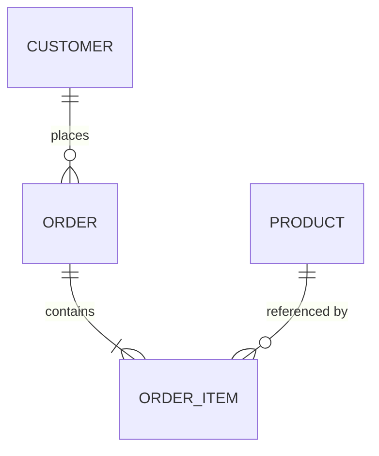

# Modeling method: from ТЗ to physical schema

This is the reasoning the agent applies between reading the spec and emitting
artifacts. The priority order is fixed: **3NF correctness first, then
performance/denormalization, then flexibility, then event-sourcing fit.**

## 1. Parse the ТЗ into modules

Read the spec and list each module with the entities it owns. Keep ownership
explicit — one table belongs to exactly one module. Ambiguity gets recorded as a
stated assumption, not a silent guess.

```
Module: orders   → Order, OrderItem
Module: catalog  → Product, Category
Module: billing  → Invoice, Payment
```

## 2. Conceptual model

For each entity: attributes, relationships, cardinality. Resolve every
many-to-many with a junction table now, not later.



## 3. Normalize to 3NF

- **1NF** — atomic columns, no repeating groups. A comma-joined `tags` column
  becomes a related table.
- **2NF** — no partial dependency on part of a composite key. Split out anything
  that depends on only half the key.
- **3NF** — no transitive dependency. If `order.customer_city` depends on
  `customer`, it belongs on `customer`, not `order`.

Record each violation you fixed in the attribute's `КОММЕНТАРИИ`.

## 4. Keys

- **Surrogate PK by default**: `BIGSERIAL` (Postgres) / `BigAutoField` (Django),
  or `UUID` when IDs are exposed externally or generated client-side. Justify a
  natural key when you choose one.
- **Foreign keys** always declare `on_delete`. Default to `PROTECT`; use
  `CASCADE` only for genuine ownership, `SET_NULL` only on nullable columns.
- **Uniqueness** is enforced in the database (`UNIQUE` / `UniqueConstraint`),
  never only in the app.

## 5. Types

| Domain | Postgres | Django |
|---|---|---|
| money | `NUMERIC(12,2)` | `DecimalField(max_digits=12, decimal_places=2)` |
| timestamp | `timestamptz` | `DateTimeField` |
| small closed set | `VARCHAR` + `CHECK` | `CharField(choices=...)` |
| large/user-managed set | lookup table + FK | `ForeignKey` |
| free text | `TEXT` | `TextField` |
| flags | `BOOLEAN` | `BooleanField` |

`created_at`/`updated_at` use `auto_now_add`/`auto_now` and are non-editable.

## 6. Indexing (from access patterns, not speculation)

Index only what a stated query needs:

- FKs used in joins and list filters.
- Columns in `WHERE` / `ORDER BY` on hot paths.
- Composite indexes in the order the query filters (equality columns first, range
  column last).
- Partial indexes for skewed predicates (`WHERE status = 'active'`).

```sql
CREATE INDEX idx_order_customer_created
    ON "order" (customer_id, created_at DESC);

CREATE INDEX idx_order_active
    ON "order" (created_at DESC)
    WHERE status IN ('new', 'paid');
```

Do not add an index "just in case" — every index costs write throughput and
storage. Note each index's target query in the data dictionary.

## 7. Deliberate denormalization (priority 2)

Only after 3NF is correct, and only against a stated read pattern. Typical moves:

- A cached `order.item_count` / `order.total_amount` updated on write, to avoid a
  join+aggregate on every list render.
- A materialized view for a heavy reporting query, refreshed on a schedule.

Every denormalized column records **why** (the query it serves) and **how it
stays consistent** (trigger, application write, scheduled refresh) in
`КОММЕНТАРИИ`. Undocumented denormalization is how data drifts.

## 8. Flexibility for growth (priority 3)

- Keep module boundaries clean so a table can later move to its own database
  without untangling cross-module FKs.
- Prefer additive change: new nullable columns and new tables over reshaping
  existing ones.
- Reserve an explicit extension point (e.g. a `metadata JSONB`) only when the ТЗ
  anticipates unknown attributes — not by default.

## 9. Event-sourcing compatibility (priority 4)

When the write model is event-sourced (coordinate with event-sourcing-architect):

- Treat the event stream as the source of truth; the relational tables here are
  **projections / read models**, designed for query shape, not for writes.
- Projections can denormalize freely — they are rebuilt from events.
- Keep aggregate boundaries aligned with module boundaries so a projection maps
  to one stream family.

## 10. Physical artifacts to emit

- **DDL** (`CREATE TABLE`, constraints, indexes).
- **Django models** with the full kwargs matching the data dictionary.
- **Migration stubs** (Django migrations or Alembic) — additive, with a rollback.
- **Mermaid ER diagram.**
- **Excel data dictionary** via the generator.

Example Django model matching the sample orders dictionary:

```python
from django.db import models
from django.core.validators import MinValueValidator


class Order(models.Model):
    class Status(models.TextChoices):
        NEW = "new", "New"
        PAID = "paid", "Paid"
        SHIPPED = "shipped", "Shipped"
        CANCELLED = "cancelled", "Cancelled"

    customer = models.ForeignKey(
        "customers.Customer",
        on_delete=models.PROTECT,
        related_name="orders",
        db_index=True,
    )
    status = models.CharField(
        max_length=20,
        choices=Status.choices,
        default=Status.NEW,
        db_index=True,
    )
    total_amount = models.DecimalField(
        max_digits=12,
        decimal_places=2,
        default=0,
        validators=[MinValueValidator(0)],
    )
    created_at = models.DateTimeField(auto_now_add=True, db_index=True)
    updated_at = models.DateTimeField(auto_now=True)

    class Meta:
        indexes = [
            models.Index(fields=["customer", "-created_at"]),
        ]
```
