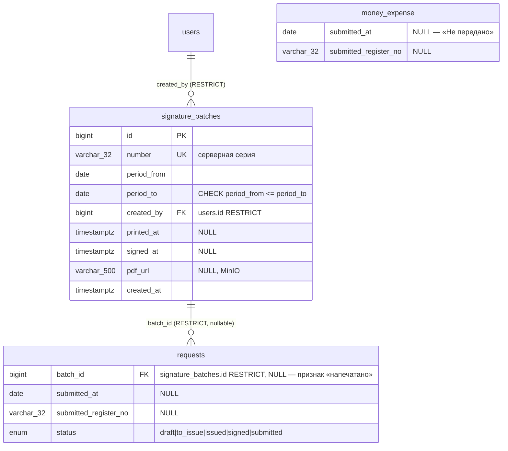

# 02 · Проектирование БД: платформа складского учёта

**Вход:** `01-requirements.md` (ТЗ, ред. 17.07.2026) + `03-architecture.md` (ADR-1, ADR-2, ADR-2a, ADR-3 — реализуются, не пересматриваются).
**Стек (ТЗ §0/§2.1, бумажная подпись):** PostgreSQL 16 · SQLAlchemy 2.0 · Alembic · Pydantic v2 · FastAPI. **Django-ветка скилла не применялась.**

**Артефакты этого шага:**

| Файл | Назначение |
|---|---|
| **`build_dictionary.py`** | **Источник правды словаря. Любая правка атрибутов делается здесь и только здесь** |
| `02-data-dictionary.xlsx` | Человекочитаемый словарь данных, 145 строк-атрибутов, 23 таблицы (после ревизии 0002 — фича 13, см. §12) — **генерируемый артефакт** |
| `02-contract.json` | **Единственный источник правды** для всех последующих агентов — **генерируемый артефакт** |
| `02-database.md` | Этот документ: обоснования, DDL, модели, миграции, план индексов |

Оба файла собраны **одним вызовом `build_all(rows, xlsx_path, contract_path)`** из одного списка строк-атрибутов — таблица для людей и контракт для машин физически не могут разойтись.

**`.xlsx` и `.json` руками не править.** Ручная правка любого из них молча ломает ровно ту гарантию, ради которой всё устроено, — расхождение всплывёт этажом ниже, у агента, читающего контракт как истину. Порядок изменения:

```bash
# 1. поправить нужный A(...) в .feature-dev/build_dictionary.py
python .feature-dev/build_dictionary.py            # 2. перегенерировать оба артефакта

# 3. гейт обязан быть зелёным (exit 0)
python .claude/skills/database-schema-design/assets/contract_validator_sqlalchemy.py \
    .feature-dev/02-contract.json backend/app/modules/*/models.py \
    backend/app/core/audit.py backend/app/modules/*/schemas.py
# 4. закоммитить скрипт и оба перегенерированных артефакта вместе
```

---

## 1. Выбор engine

**PostgreSQL 16** — предписан ТЗ §2.1/§7 и подтверждается требованиями по существу; альтернативы не рассматривались, потому что каждая из них ломает заявленное требование:

| Требование ТЗ | Что даёт именно PostgreSQL | Почему альтернатива не проходит |
|---|---|---|
| INV-1…INV-9 «на уровне БД, не только в коде» (§5) | CHECK-constraints, в т.ч. многоколоночные и с выражениями; составные FK | MySQL до 8.0.16 CHECK игнорирует молча; в MariaDB нет составных FK на UNIQUE-пары в нужном виде |
| AP-2/AP-3: очередь «К печати», `COUNT` каждые 30 сек на каждого админа | **Частичные индексы** `WHERE status='to_print'` — индекс размером в десятки строк вместо миллионов | MySQL частичных индексов не имеет: индекс по всему `status` в разы больше и холоднее |
| AP-1: остаток ≤500 мс при конкурентных списаниях | `SELECT … FOR UPDATE` + MVCC без эскалации блокировок в табличную | — |
| Деньги `NUMERIC(18,2)`, количество `NUMERIC(14,3)` (§3) | Точная десятичная арифметика | — |
| `audit_log.payload_diff` | Нативный `jsonb` | — |
| `audit_log.ip` | Нативный тип `inet` с валидацией и сравнением подсетей | В MySQL — `varbinary(16)` и ручная сериализация |
| Enum-множества (§5) | Нативные `CREATE TYPE … AS ENUM` |  — |

NoSQL отклонён: домен — классический OLTP с деньгами, проводками и межтабличными инвариантами; отказ от транзакций и FK здесь означает отказ от учёта. Полиглотность в системе уже есть и она правильная: Redis — брокер/кеш, MinIO — файлы, **системой записи остаётся Postgres**.

---

## 2. Модули → сущности

| Модуль | Таблицы | Комментарий |
|---|---|---|
| **М1. Справочники (НСИ)** | `users`, `units`, `products`, `warehouses`, `expense_types`, `expense_categories` | `expense_types` — расход **товара**; `expense_categories` — расход **денег**. Похожие имена, разные домены. `warehouses.allows_issuance` — «склад списания» (SV-9) |
| **М2. Документооборот товаров** | `notifications`, `notification_items`, `acquisitions`, `acquisition_items`, `transfers`, `transfer_items` | Одно уведомление → много приобретений (закупка частями) |
| **М3. Складской учёт** | `stock_movements` (источник правды, append-only), `stock_balances` (проекция) | ADR-1 |
| **М4. Заявки и печать** | `requests`, `request_items`, `writeoffs`, `writeoff_items` | ADR-2: две таблицы, связь `requests.writeoff_id` |
| **М5. Кассы и деньги** | `cash_desks`, `money_income`, `money_expense` | `cash_desks` — ровно две строки (seed) |
| **М6. Отчётность** | — собственных таблиц нет | Отчёты §8.1–8.2 — запросы поверх М2/М3/М5. Materialized views не вводятся: ни один AP не требует, а они дали бы третий источник правды об остатке |
| **М7. Администрирование** | `audit_log` (+ `users` из М1) | Роли — `users.role`, отдельной таблицы ролей ТЗ не предполагает: множество из трёх значений закрыто (§5) |

**Итого 22 таблицы, 131 атрибут.** Новых сущностей сверх §3 ТЗ не введено. (+3 атрибута в `notifications` под печатную форму BILDIRISHNOMA — см. §7.5; новой таблицы правка не потребовала.)

`writeoffs.requires_employee` — единственная **колонка**, которой нет в §3 ТЗ. Это не новая сущность, а техническое средство реализации INV-4; обоснование — §7.2.

---

## 3. ER-диаграмма

```mermaid
erDiagram
    users ||--o{ notifications : "author_id"
    users ||--o{ acquisitions : "author_id"
    users ||--o{ transfers : "author_id"
    users ||--o{ requests : "employee_id (AP-4)"
    users ||--o{ writeoffs : "author_id"
    users ||--o{ writeoffs : "employee_id NULL (INV-4)"
    users ||--o{ money_income : "author_id"
    users ||--o{ money_expense : "employee_id"
    users ||--o{ audit_log : "user_id"

    units ||--o{ products : "unit_id"
    products ||--o{ notification_items : ""
    products ||--o{ acquisition_items : ""
    products ||--o{ transfer_items : ""
    products ||--o{ request_items : ""
    products ||--o{ writeoff_items : ""
    products ||--o{ stock_movements : ""
    products ||--o{ stock_balances : ""

    warehouses ||--o{ notifications : "warehouse_id"
    warehouses ||--o{ acquisitions : "warehouse_id"
    warehouses ||--o{ transfers : "from/to (INV-5)"
    warehouses ||--o{ requests : "warehouse_id (SV-9: allows_issuance)"
    warehouses ||--o{ writeoffs : "warehouse_id"
    warehouses ||--o{ stock_movements : ""
    warehouses ||--o{ stock_balances : ""

    notifications ||--o{ notification_items : "CASCADE"
    notifications ||--o{ acquisitions : "RESTRICT (1:N, закупка частями)"
    acquisitions  ||--o{ acquisition_items : "CASCADE"
    transfers     ||--o{ transfer_items : "CASCADE"

    requests  ||--o{ request_items : "CASCADE"
    requests  |o--o| writeoffs : "writeoff_id UNIQUE NULL (INV-2/INV-3, AP-11)"
    writeoffs ||--o{ writeoff_items : "CASCADE"
    expense_types ||--o{ writeoffs : "составной FK (id, requires_employee) — INV-4"

    stock_movements }o--|| stock_balances : "проекция (ADR-1, AP-1)"

    warehouses {
        bigserial id PK
        varchar_32 code UK
        varchar_255 name
        varchar_500 address
        boolean allows_issuance "SV-9: заявка только сюда; может быть несколько"
        enum status "active|archived"
    }

    cash_desks ||--o{ money_income : "cash_desk_id"
    cash_desks ||--o{ money_expense : "cash_desk_id (SV-6: ставит сервер)"
    expense_categories ||--o{ money_expense : "AP-8"

    users {
        bigserial id PK
        varchar_255 full_name
        varchar_150 username UK
        varchar_255 password_hash "Argon2id, наружу не отдаётся"
        enum role "admin|teacher|worker"
        enum category "teacher|worker NULL — INV-9"
        boolean is_active
        timestamptz created_at
    }
    requests {
        bigserial id PK
        varchar_32 number UK "печатается на бумаге (ADR-2a)"
        bigint employee_id FK
        bigint warehouse_id FK
        text reason
        enum status "draft|to_print|printed|issued"
        timestamptz printed_at
        timestamptz issued_at
        bigint writeoff_id FK "UNIQUE NULL — INV-2"
        varchar_500 pdf_url
        timestamptz created_at
    }
    writeoffs {
        bigserial id PK
        varchar_32 number UK "независимая серия"
        date date
        bigint warehouse_id FK
        bigint expense_type_id FK
        boolean requires_employee "копия флага — INV-4"
        bigint employee_id FK "NULL при порче/браке"
        bigint author_id FK
    }
    stock_movements {
        bigserial id PK
        bigint product_id FK
        bigint warehouse_id FK
        numeric_14_3 qty "СО ЗНАКОМ: + приход, − расход"
        enum doc_type "acquisition|transfer|writeoff"
        bigint doc_id "полиморфная ссылка, FK нет"
        timestamptz created_at
    }
    stock_balances {
        bigserial id PK
        bigint product_id FK
        bigint warehouse_id FK
        numeric_14_3 qty "CHECK >= 0 — INV-1"
    }
    cash_desks {
        bigserial id PK
        enum type "teacher|worker UNIQUE"
        numeric_18_2 balance "CHECK >= 0 — INV-8/ОВ-2"
    }
```



---

## 4. Нормализация

Схема в **3NF**. Что решалось по ходу:

| Что | Решение |
|---|---|
| **1NF** | Все атрибуты атомарны. Единственный `jsonb` — `audit_log.payload_diff`; это не нарушение: диф — непрозрачный документ аудита, по его внутренностям не ищут (нет AP), реляционно раскладывать нечего |
| **2NF** | Все `*_items` вынесены из шапок документов в отдельные таблицы: количество зависит от пары (документ, товар), а не от документа |
| **3NF: ЕИ в строках документов** | **Не хранится.** Единица измерения зависит от `product_id`, а не от строки документа → транзитивная зависимость. Берётся из `products.unit_id` (ТЗ §3 прямо это фиксирует) |
| **3NF: `notification_items.qty_purchased` и «остаток к приобретению»** | **Не хранятся** (ТЗ §3, ADR): вычисляются из `SUM(acquisition_items.qty)`. Хранение дало бы второй источник правды и рассинхрон при удалении приобретения |
| **3NF: стоимость строки** | Не хранится: `qty × price` — производное |
| **Баланс кассы** | `cash_desks.balance` хранится. Формально то же, что и `stock_balances` (агрегат от `money_income`/`money_expense`), обоснование — AP-9 (`FOR UPDATE` при каждом расходе) и ADR §4. Зафиксировано ТЗ §3 как атрибут сущности |
| **M:N** | Отсутствуют. Все связи документ→строки — 1:N; junction-таблицы не нужны |
| **Ключи** | Везде суррогатный `bigserial`. Натуральные (`units.code`, `warehouses.code`, `number`) вынесены в UNIQUE-ограничения, но PK не являются: номера генерирует сервер, а бизнес-код склада заказчик может переименовать — это не должно каскадиться по истории движений |

### Осознанные отступления

| # | Отступление | Обоснование |
|---|---|---|
| **Д-1** | `stock_balances` — денормализованная проекция `stock_movements` | **AP-1** + ADR-1. Единственная денормализация, санкционированная заранее. Защита: обновление в той же транзакции, `FOR UPDATE`, CHECK `qty >= 0`, ночной `reconcile_stock` |
| **Д-2** | `writeoffs.requires_employee` — копия `expense_types.requires_employee` | **Не под AP, а под INV-4.** Развёрнуто в §7.2 |
| **Д-3** | `stock_movements.doc_id` — полиморфная ссылка **без FK** | Целостность обеспечивает единая точка записи `ledger.post()` (SV-2). Альтернатива — три nullable FK (`acquisition_id`/`transfer_id`/`writeoff_id`) — держала бы две пустые колонки в каждой строке самой горячей и самой длинной таблицы системы. Это не нарушение нормальных форм, а осознанный отказ от декларативной ссылочной целостности; фиксирую явно, потому что цена — «висячий» `doc_id` при ошибке в ledger, ловится тем же ночным ревизором |

**`qty_reserved` не добавлен** (§8 — вне scope, ADR-3: добавляется потом без ломки схемы).

---

## 5. SQL DDL

```sql
-- ═══════════════════════════════════════════════════════════════════
--  Платформа складского учёта · PostgreSQL 16 · greenfield
-- ═══════════════════════════════════════════════════════════════════
CREATE TYPE user_role           AS ENUM ('admin', 'teacher', 'worker');
CREATE TYPE user_category       AS ENUM ('teacher', 'worker');
CREATE TYPE catalog_status      AS ENUM ('active', 'archived');
CREATE TYPE notification_status AS ENUM ('draft', 'in_progress', 'closed');
CREATE TYPE request_status      AS ENUM ('draft', 'to_print', 'printed', 'issued');
CREATE TYPE movement_doc_type   AS ENUM ('acquisition', 'transfer', 'writeoff');
CREATE TYPE cash_desk_type      AS ENUM ('teacher', 'worker');

-- ─────────────────────────── М1. Справочники ───────────────────────
CREATE TABLE users (
    id            bigserial     PRIMARY KEY,
    full_name     varchar(255)  NOT NULL,
    username      varchar(150)  NOT NULL UNIQUE,
    password_hash varchar(255)  NOT NULL,
    role          user_role     NOT NULL,
    category      user_category NULL,
    is_active     boolean       NOT NULL DEFAULT true,
    created_at    timestamptz   NOT NULL DEFAULT now(),
    CONSTRAINT ck_users_full_name_not_blank CHECK (length(trim(full_name)) > 0),
    -- INV-9: category IS NULL ⟺ role = 'admin'
    CONSTRAINT ck_users_category_iff_admin
        CHECK ((category IS NULL) = (role = 'admin'))
);
CREATE INDEX ix_users_role ON users (role);

CREATE TABLE units (
    id        bigserial    PRIMARY KEY,
    code      varchar(16)  NOT NULL UNIQUE,
    name      varchar(100) NOT NULL,
    is_active boolean      NOT NULL DEFAULT true
);

CREATE TABLE products (
    id      bigserial      PRIMARY KEY,
    name    varchar(255)   NOT NULL,
    unit_id bigint         NOT NULL REFERENCES units (id) ON DELETE RESTRICT,
    sku     varchar(64)    NULL,
    status  catalog_status NOT NULL DEFAULT 'active'
);
CREATE INDEX ix_products_unit_id ON products (unit_id);
CREATE INDEX ix_products_status  ON products (status);

CREATE TABLE warehouses (
    id              bigserial      PRIMARY KEY,
    code            varchar(32)    NOT NULL UNIQUE,
    name            varchar(255)   NOT NULL,
    address         varchar(500)   NULL,
    -- SV-9 / ОВ-5: «Склад списания». Отмеченных складов может быть НЕСКОЛЬКО —
    -- частичного уникального индекса здесь быть не должно.
    allows_issuance boolean        NOT NULL DEFAULT false,
    status          catalog_status NOT NULL DEFAULT 'active'
);
CREATE INDEX ix_warehouses_status ON warehouses (status);
-- AP-12: отдельный индекс по allows_issuance НЕ создаётся — справочник крошечный,
-- планировщик возьмёт seq scan и будет прав.

CREATE TABLE expense_types (                    -- расход ТОВАРА
    id                bigserial      PRIMARY KEY,
    name              varchar(100)   NOT NULL,
    requires_employee boolean        NOT NULL,
    status            catalog_status NOT NULL DEFAULT 'active',
    -- INV-4: целевой ключ составного FK из writeoffs
    CONSTRAINT uq_expense_types_id_requires_employee UNIQUE (id, requires_employee)
);

CREATE TABLE expense_categories (               -- расход ДЕНЕГ
    id     bigserial      PRIMARY KEY,
    name   varchar(100)   NOT NULL,
    status catalog_status NOT NULL DEFAULT 'active'
);

-- ─────────────────── М2. Документооборот товаров ───────────────────
CREATE TABLE notifications (
    id           bigserial           PRIMARY KEY,
    number       varchar(32)         NOT NULL UNIQUE,
    date         date                NOT NULL,
    author_id    bigint              NOT NULL REFERENCES users (id)      ON DELETE RESTRICT,
    warehouse_id bigint              NOT NULL REFERENCES warehouses (id) ON DELETE RESTRICT,
    status       notification_status NOT NULL DEFAULT 'draft',
    comment      text                NULL,                       -- бланк: Ehtiyojning asoslanishi
    -- ── Печатная форма BILDIRISHNOMA (уточнение заказчика 17.07.2026) ──
    body_text     text        NOT NULL,   -- абзац-обращение «Sizdan… so‘rayman:»
    division_name varchar(255) NOT NULL,  -- Bo‘linma nomi, свободный текст
    pdf_url       varchar(500) NULL,      -- снимок бланка в MinIO, ставит сервер
    created_at   timestamptz         NOT NULL DEFAULT now(),
    CONSTRAINT ck_notifications_body_text_not_blank
        CHECK (length(trim(body_text)) > 0),
    CONSTRAINT ck_notifications_division_name_not_blank
        CHECK (length(trim(division_name)) > 0)
);
CREATE INDEX ix_notifications_author_id    ON notifications (author_id);
CREATE INDEX ix_notifications_warehouse_id ON notifications (warehouse_id);
CREATE INDEX ix_notifications_status       ON notifications (status);
CREATE INDEX ix_notifications_date         ON notifications (date DESC);
-- body_text / division_name / pdf_url индексов не получают: access pattern
-- на поиск по ним в ТЗ §4 не заявлен (правило проекта — индекс только под AP).

CREATE TABLE notification_items (
    id              bigserial     PRIMARY KEY,
    notification_id bigint        NOT NULL REFERENCES notifications (id) ON DELETE CASCADE,
    product_id      bigint        NOT NULL REFERENCES products (id)      ON DELETE RESTRICT,
    qty_requested   numeric(14,3) NOT NULL,
    CONSTRAINT ck_notification_items_qty_positive CHECK (qty_requested > 0),  -- INV-6
    -- AP-6/AP-7 агрегируют по (notification_id, product_id) — пара обязана быть уникальной
    CONSTRAINT uq_notification_items_notification_product UNIQUE (notification_id, product_id)
);
CREATE INDEX ix_notification_items_product_id ON notification_items (product_id);

CREATE TABLE acquisitions (
    id              bigserial    PRIMARY KEY,
    number          varchar(32)  NOT NULL UNIQUE,
    date            date         NOT NULL,
    notification_id bigint       NOT NULL REFERENCES notifications (id) ON DELETE RESTRICT,
    warehouse_id    bigint       NOT NULL REFERENCES warehouses (id)    ON DELETE RESTRICT,
    supplier        varchar(255) NULL,
    author_id       bigint       NOT NULL REFERENCES users (id)         ON DELETE RESTRICT
);
CREATE INDEX ix_acquisitions_notification_id ON acquisitions (notification_id);  -- AP-6
CREATE INDEX ix_acquisitions_warehouse_id    ON acquisitions (warehouse_id);
CREATE INDEX ix_acquisitions_author_id       ON acquisitions (author_id);
CREATE INDEX ix_acquisitions_date            ON acquisitions (date DESC);

CREATE TABLE acquisition_items (
    id             bigserial     PRIMARY KEY,
    acquisition_id bigint        NOT NULL REFERENCES acquisitions (id) ON DELETE CASCADE,
    product_id     bigint        NOT NULL REFERENCES products (id)     ON DELETE RESTRICT,
    qty            numeric(14,3) NOT NULL,
    price          numeric(18,2) NULL,
    CONSTRAINT ck_acquisition_items_qty_positive CHECK (qty > 0),        -- INV-6
    CONSTRAINT ck_acquisition_items_price_non_negative
        CHECK (price IS NULL OR price >= 0)
);
CREATE INDEX ix_acquisition_items_acquisition_id ON acquisition_items (acquisition_id);
CREATE INDEX ix_acquisition_items_product_id     ON acquisition_items (product_id);  -- AP-6

CREATE TABLE transfers (
    id                bigserial   PRIMARY KEY,
    number            varchar(32) NOT NULL UNIQUE,
    date              date        NOT NULL,
    from_warehouse_id bigint      NOT NULL REFERENCES warehouses (id) ON DELETE RESTRICT,
    to_warehouse_id   bigint      NOT NULL REFERENCES warehouses (id) ON DELETE RESTRICT,
    author_id         bigint      NOT NULL REFERENCES users (id)      ON DELETE RESTRICT,
    -- INV-5
    CONSTRAINT ck_transfers_different_warehouses
        CHECK (from_warehouse_id <> to_warehouse_id)
);
CREATE INDEX ix_transfers_from_warehouse_id ON transfers (from_warehouse_id);
CREATE INDEX ix_transfers_to_warehouse_id   ON transfers (to_warehouse_id);
CREATE INDEX ix_transfers_author_id         ON transfers (author_id);
CREATE INDEX ix_transfers_date              ON transfers (date DESC);

CREATE TABLE transfer_items (
    id          bigserial     PRIMARY KEY,
    transfer_id bigint        NOT NULL REFERENCES transfers (id) ON DELETE CASCADE,
    product_id  bigint        NOT NULL REFERENCES products (id)  ON DELETE RESTRICT,
    qty         numeric(14,3) NOT NULL,
    CONSTRAINT ck_transfer_items_qty_positive CHECK (qty > 0)            -- INV-6
);
CREATE INDEX ix_transfer_items_transfer_id ON transfer_items (transfer_id);
CREATE INDEX ix_transfer_items_product_id  ON transfer_items (product_id);

-- ────────────── М4. Расход товара (проводка) — до requests ─────────
-- Порядок важен: requests.writeoff_id ссылается на writeoffs.
-- Обратной ссылки нет, поэтому цикла FK не возникает.
CREATE TABLE writeoffs (
    id                bigserial   PRIMARY KEY,
    number            varchar(32) NOT NULL UNIQUE,
    date              date        NOT NULL,
    warehouse_id      bigint      NOT NULL REFERENCES warehouses (id) ON DELETE RESTRICT,
    expense_type_id   bigint      NOT NULL,
    requires_employee boolean     NOT NULL,      -- Д-2: копия флага, синхронизируется FK
    employee_id       bigint      NULL     REFERENCES users (id)      ON DELETE RESTRICT,
    author_id         bigint      NOT NULL REFERENCES users (id)      ON DELETE RESTRICT,

    -- INV-4, часть 1: копия флага не может разойтись с справочником.
    -- ON UPDATE CASCADE — переключение requires_employee у типа расхода
    -- автоматически протянется в проводки.
    CONSTRAINT fk_writeoffs_expense_type
        FOREIGN KEY (expense_type_id, requires_employee)
        REFERENCES expense_types (id, requires_employee)
        ON UPDATE CASCADE ON DELETE RESTRICT,

    -- INV-4, часть 2: теперь правило локально для строки и выражается CHECK-ом.
    -- «Выдача» ⇒ сотрудник обязателен; «Порча»/«Брак» ⇒ сотрудник запрещён.
    CONSTRAINT ck_writeoffs_employee_iff_required
        CHECK ((employee_id IS NOT NULL) = requires_employee)
);
CREATE INDEX ix_writeoffs_warehouse_id    ON writeoffs (warehouse_id);
CREATE INDEX ix_writeoffs_expense_type_id ON writeoffs (expense_type_id);
CREATE INDEX ix_writeoffs_employee_id     ON writeoffs (employee_id);
CREATE INDEX ix_writeoffs_author_id       ON writeoffs (author_id);
CREATE INDEX ix_writeoffs_date            ON writeoffs (date DESC);

CREATE TABLE writeoff_items (
    id          bigserial     PRIMARY KEY,
    writeoff_id bigint        NOT NULL REFERENCES writeoffs (id) ON DELETE CASCADE,
    product_id  bigint        NOT NULL REFERENCES products (id)  ON DELETE RESTRICT,
    qty         numeric(14,3) NOT NULL,
    reason      varchar(500)  NULL,
    CONSTRAINT ck_writeoff_items_qty_positive CHECK (qty > 0)            -- INV-6
);
CREATE INDEX ix_writeoff_items_writeoff_id ON writeoff_items (writeoff_id);
CREATE INDEX ix_writeoff_items_product_id  ON writeoff_items (product_id);

-- ─────────────── М4. Заявка (документ-основание) ───────────────────
CREATE TABLE requests (
    id           bigserial      PRIMARY KEY,
    number       varchar(32)    NOT NULL UNIQUE,
    employee_id  bigint         NOT NULL REFERENCES users (id)      ON DELETE RESTRICT,
    warehouse_id bigint         NOT NULL REFERENCES warehouses (id) ON DELETE RESTRICT,
    reason       text           NOT NULL,
    status       request_status NOT NULL DEFAULT 'draft',
    printed_at   timestamptz    NULL,
    issued_at    timestamptz    NULL,
    writeoff_id  bigint         NULL REFERENCES writeoffs (id) ON DELETE RESTRICT,
    pdf_url      varchar(500)   NULL,
    created_at   timestamptz    NOT NULL DEFAULT now(),

    CONSTRAINT ck_requests_reason_not_blank CHECK (length(trim(reason)) > 0),
    -- INV-2 — ГЛАВНАЯ защита модели ADR-2: выдана ⟺ есть проводка
    CONSTRAINT ck_requests_issued_iff_posted
        CHECK ((status = 'issued') = (writeoff_id IS NOT NULL)),
    -- INV-3: одна проводка не принадлежит двум заявкам
    CONSTRAINT uq_requests_writeoff_id UNIQUE (writeoff_id)
);
-- AP-2 + AP-3: очередь «К печати» и бейдж-счётчик. Частичный индекс:
-- содержит только строки to_print, поэтому COUNT каждые 30 сек читает
-- index-only несколько страниц вместо миллионов строк.
CREATE INDEX ix_requests_to_print ON requests (id) WHERE status = 'to_print';
CREATE INDEX ix_requests_employee_created ON requests (employee_id, created_at DESC);  -- AP-4
CREATE INDEX ix_requests_warehouse_id     ON requests (warehouse_id);
CREATE INDEX ix_requests_status           ON requests (status);
-- AP-11 (проводка → заявка → бумага) покрыт UNIQUE-индексом uq_requests_writeoff_id.

CREATE TABLE request_items (
    id         bigserial     PRIMARY KEY,
    request_id bigint        NOT NULL REFERENCES requests (id) ON DELETE CASCADE,
    product_id bigint        NOT NULL REFERENCES products (id) ON DELETE RESTRICT,
    qty        numeric(14,3) NOT NULL,
    CONSTRAINT ck_request_items_qty_positive CHECK (qty > 0)             -- INV-6
);
CREATE INDEX ix_request_items_request_id ON request_items (request_id);
CREATE INDEX ix_request_items_product_id ON request_items (product_id);

-- ── SV-9: заявка только со склада списания ─────────────────────────
-- Правило МОМЕНТА ПОДАЧИ: проверяется, когда заявка создаётся или когда
-- ей меняют склад. Снятие галочки со склада НЕ инвалидирует уже поданные
-- заявки — поэтому это триггер, а не FK на (id, allows_issuance).
-- Область действия — ТОЛЬКО requests: порча/брак, приобретения и
-- перемещения работают с любым складом (ТЗ §3).
CREATE OR REPLACE FUNCTION trg_requests_check_issuance_warehouse()
RETURNS trigger
LANGUAGE plpgsql AS $$
DECLARE
    v_allows boolean;
    v_name   varchar(255);
BEGIN
    -- Склад не менялся → правило не применяем. Без этой ветки UPDATE,
    -- пришедший с warehouse_id в SET-списке (например, полнострочный
    -- UPDATE из ORM), уронил бы issue() у старой заявки, чей склад с тех
    -- пор потерял галочку, — то самое инвалидирование задним числом,
    -- которого ТЗ требует избежать.
    IF TG_OP = 'UPDATE' AND NEW.warehouse_id IS NOT DISTINCT FROM OLD.warehouse_id THEN
        RETURN NEW;
    END IF;

    SELECT allows_issuance, name INTO v_allows, v_name
      FROM warehouses WHERE id = NEW.warehouse_id;

    IF NOT v_allows THEN
        RAISE EXCEPTION
            'Склад "%" не является складом списания — заявка на него невозможна', v_name
            USING ERRCODE = 'check_violation';
    END IF;
    RETURN NEW;
END;
$$;

-- UPDATE OF warehouse_id: на переходах статусов (confirm/print/issue)
-- триггер не срабатывает вовсе — они склад не трогают.
CREATE TRIGGER requests_check_issuance_warehouse
    BEFORE INSERT OR UPDATE OF warehouse_id ON requests
    FOR EACH ROW
    EXECUTE FUNCTION trg_requests_check_issuance_warehouse();

-- ─────────────────────── М3. Ядро учёта ────────────────────────────
CREATE TABLE stock_movements (
    id           bigserial         PRIMARY KEY,
    product_id   bigint            NOT NULL REFERENCES products (id)   ON DELETE RESTRICT,
    warehouse_id bigint            NOT NULL REFERENCES warehouses (id) ON DELETE RESTRICT,
    qty          numeric(14,3)     NOT NULL,      -- СО ЗНАКОМ: + приход, − расход
    doc_type     movement_doc_type NOT NULL,
    doc_id       bigint            NOT NULL,      -- полиморфная ссылка (Д-3), FK нет
    created_at   timestamptz       NOT NULL DEFAULT now(),
    -- CHECK (qty > 0) здесь НЕВОЗМОЖЕН: поле знаковое. Запрещаем лишь пустое движение.
    CONSTRAINT ck_stock_movements_qty_non_zero CHECK (qty <> 0)
);
-- AP-5: история движений, keyset-пагинация по (created_at, id).
CREATE INDEX ix_stock_movements_product_wh_created
    ON stock_movements (product_id, warehouse_id, created_at DESC, id DESC);
CREATE INDEX ix_stock_movements_wh_created
    ON stock_movements (warehouse_id, created_at DESC, id DESC);
CREATE INDEX ix_stock_movements_doc ON stock_movements (doc_type, doc_id);

CREATE TABLE stock_balances (
    id           bigserial     PRIMARY KEY,
    product_id   bigint        NOT NULL REFERENCES products (id)   ON DELETE RESTRICT,
    warehouse_id bigint        NOT NULL REFERENCES warehouses (id) ON DELETE RESTRICT,
    qty          numeric(14,3) NOT NULL DEFAULT 0,
    -- INV-1: последний рубеж против ухода остатка в минус
    CONSTRAINT ck_stock_balances_qty_non_negative CHECK (qty >= 0),
    -- AP-1: точечный поиск (product, warehouse) + FOR UPDATE
    CONSTRAINT uq_stock_balances_product_warehouse UNIQUE (product_id, warehouse_id)
);
-- AP-10: отчёт «остатки по складам» — обход в порядке склад → товар
CREATE INDEX ix_stock_balances_warehouse_product ON stock_balances (warehouse_id, product_id);

-- ────────────────────── М5. Кассы и деньги ─────────────────────────
CREATE TABLE cash_desks (
    id      bigserial      PRIMARY KEY,
    type    cash_desk_type NOT NULL UNIQUE,       -- ровно две строки (seed)
    balance numeric(18,2)  NOT NULL DEFAULT 0,
    -- INV-8 — по допущению ОВ-2 «жёсткая блокировка». См. §7.4.
    CONSTRAINT ck_cash_desks_balance_non_negative CHECK (balance >= 0)
);

CREATE TABLE money_income (
    id           bigserial     PRIMARY KEY,
    cash_desk_id bigint        NOT NULL REFERENCES cash_desks (id) ON DELETE RESTRICT,
    amount       numeric(18,2) NOT NULL,
    date         date          NOT NULL,
    author_id    bigint        NOT NULL REFERENCES users (id)      ON DELETE RESTRICT,
    comment      varchar(500)  NULL,
    CONSTRAINT ck_money_income_amount_positive CHECK (amount > 0)
);
CREATE INDEX ix_money_income_cash_desk_date ON money_income (cash_desk_id, date DESC);
CREATE INDEX ix_money_income_author_id      ON money_income (author_id);

CREATE TABLE money_expense (
    id                  bigserial     PRIMARY KEY,
    cash_desk_id        bigint        NOT NULL REFERENCES cash_desks (id)         ON DELETE RESTRICT,
    employee_id         bigint        NOT NULL REFERENCES users (id)              ON DELETE RESTRICT,
    expense_category_id bigint        NOT NULL REFERENCES expense_categories (id) ON DELETE RESTRICT,
    amount              numeric(18,2) NOT NULL,
    description         text          NOT NULL,
    receipt_url         varchar(500)  NOT NULL,   -- INV-7: чек обязателен
    date                date          NOT NULL,
    CONSTRAINT ck_money_expense_amount_positive CHECK (amount > 0),
    CONSTRAINT ck_money_expense_description_not_blank
        CHECK (length(trim(description)) > 0),
    -- INV-7: без этого CHECK пустая строка '' обойдёт NOT NULL и чек станет фикцией
    CONSTRAINT ck_money_expense_receipt_not_blank
        CHECK (length(trim(receipt_url)) > 0)
);
-- AP-8: отчёт ДДС. Фильтр по категории обязателен → отдельный composite.
CREATE INDEX ix_money_expense_category_date  ON money_expense (expense_category_id, date DESC);
CREATE INDEX ix_money_expense_cash_desk_date ON money_expense (cash_desk_id, date DESC);
CREATE INDEX ix_money_expense_employee_date  ON money_expense (employee_id, date DESC);

-- ──────────────────────────── М7. Аудит ────────────────────────────
CREATE TABLE audit_log (
    id           bigserial    PRIMARY KEY,
    user_id      bigint       NOT NULL REFERENCES users (id) ON DELETE RESTRICT,
    action       varchar(50)  NOT NULL,
    entity       varchar(100) NOT NULL,
    entity_id    bigint       NULL,
    payload_diff jsonb        NULL,
    ip           inet         NULL,
    created_at   timestamptz  NOT NULL DEFAULT now()
);
CREATE INDEX ix_audit_log_user_id    ON audit_log (user_id);
CREATE INDEX ix_audit_log_entity     ON audit_log (entity, entity_id);
CREATE INDEX ix_audit_log_action     ON audit_log (action);
CREATE INDEX ix_audit_log_created_at ON audit_log (created_at DESC);

-- ───────────────────────── seed: две кассы ─────────────────────────
INSERT INTO cash_desks (type, balance) VALUES ('teacher', 0), ('worker', 0);
```

---

## 6. SQLAlchemy 2.0 модели

Declarative, `Mapped[]` / `mapped_column`. **Django ORM не используется.**

```python
# app/core/database.py
from datetime import date, datetime
from decimal import Decimal
from enum import Enum

from sqlalchemy import (
    BigInteger, Boolean, CheckConstraint, Date, DateTime, Enum as SAEnum,
    ForeignKey, ForeignKeyConstraint, Index, Numeric, String, Text,
    UniqueConstraint, func, text,
)
from sqlalchemy.dialects.postgresql import INET, JSONB
from sqlalchemy.orm import DeclarativeBase, Mapped, mapped_column, relationship


class Base(DeclarativeBase):
    pass


# ─────────────────────────── Enums ──────────────────────────────────
class UserRole(str, Enum):
    admin = "admin"; teacher = "teacher"; worker = "worker"

class UserCategory(str, Enum):
    teacher = "teacher"; worker = "worker"

class CatalogStatus(str, Enum):
    active = "active"; archived = "archived"

class NotificationStatus(str, Enum):
    draft = "draft"; in_progress = "in_progress"; closed = "closed"

class RequestStatus(str, Enum):
    draft = "draft"; to_print = "to_print"; printed = "printed"; issued = "issued"

class MovementDocType(str, Enum):
    acquisition = "acquisition"; transfer = "transfer"; writeoff = "writeoff"

class CashDeskType(str, Enum):
    teacher = "teacher"; worker = "worker"


# ═══════════════════════ М1. Справочники ════════════════════════════
class User(Base):
    __tablename__ = "users"
    __table_args__ = (
        CheckConstraint("length(trim(full_name)) > 0", name="ck_users_full_name_not_blank"),
        # INV-9
        CheckConstraint("(category IS NULL) = (role = 'admin')",
                        name="ck_users_category_iff_admin"),
        Index("ix_users_role", "role"),
    )
    id: Mapped[int] = mapped_column(BigInteger, primary_key=True)
    full_name: Mapped[str] = mapped_column(String(255), nullable=False)
    username: Mapped[str] = mapped_column(String(150), nullable=False, unique=True)
    password_hash: Mapped[str] = mapped_column(String(255), nullable=False)
    role: Mapped[UserRole] = mapped_column(
        SAEnum(UserRole, name="user_role"), nullable=False)
    category: Mapped[UserCategory | None] = mapped_column(
        SAEnum(UserCategory, name="user_category"), nullable=True)
    is_active: Mapped[bool] = mapped_column(
        Boolean, nullable=False, server_default=text("true"))
    created_at: Mapped[datetime] = mapped_column(
        DateTime(timezone=True), nullable=False, server_default=func.now())


class Unit(Base):
    __tablename__ = "units"
    id: Mapped[int] = mapped_column(BigInteger, primary_key=True)
    code: Mapped[str] = mapped_column(String(16), nullable=False, unique=True)
    name: Mapped[str] = mapped_column(String(100), nullable=False)
    is_active: Mapped[bool] = mapped_column(
        Boolean, nullable=False, server_default=text("true"))


class Product(Base):
    __tablename__ = "products"
    __table_args__ = (Index("ix_products_status", "status"),)
    id: Mapped[int] = mapped_column(BigInteger, primary_key=True)
    name: Mapped[str] = mapped_column(String(255), nullable=False)
    unit_id: Mapped[int] = mapped_column(
        BigInteger, ForeignKey("units.id", ondelete="RESTRICT"),
        nullable=False, index=True)
    sku: Mapped[str | None] = mapped_column(String(64), nullable=True)
    status: Mapped[CatalogStatus] = mapped_column(
        SAEnum(CatalogStatus, name="catalog_status"),
        nullable=False, server_default=text("'active'"))
    unit: Mapped["Unit"] = relationship()


class Warehouse(Base):
    __tablename__ = "warehouses"
    __table_args__ = (Index("ix_warehouses_status", "status"),)
    id: Mapped[int] = mapped_column(BigInteger, primary_key=True)
    code: Mapped[str] = mapped_column(String(32), nullable=False, unique=True)
    name: Mapped[str] = mapped_column(String(255), nullable=False)
    address: Mapped[str | None] = mapped_column(String(500), nullable=True)
    # SV-9 / ОВ-5: «Склад списания». Заявку сотрудник может подать только сюда.
    # Отмеченных складов может быть несколько → никакого unique/partial-unique.
    # Правило принудительно проверяет триггер requests_check_issuance_warehouse.
    allows_issuance: Mapped[bool] = mapped_column(
        Boolean, nullable=False, server_default=text("false"))
    status: Mapped[CatalogStatus] = mapped_column(
        SAEnum(CatalogStatus, name="catalog_status"),
        nullable=False, server_default=text("'active'"))


class ExpenseType(Base):
    """Тип расхода ТОВАРА: Выдача сотруднику / Порча / Брак."""
    __tablename__ = "expense_types"
    __table_args__ = (
        # INV-4: целевой ключ составного FK из writeoffs
        UniqueConstraint("id", "requires_employee",
                         name="uq_expense_types_id_requires_employee"),
    )
    id: Mapped[int] = mapped_column(BigInteger, primary_key=True)
    name: Mapped[str] = mapped_column(String(100), nullable=False)
    requires_employee: Mapped[bool] = mapped_column(Boolean, nullable=False)
    status: Mapped[CatalogStatus] = mapped_column(
        SAEnum(CatalogStatus, name="catalog_status"),
        nullable=False, server_default=text("'active'"))


class ExpenseCategory(Base):
    """Вид расхода ДЕНЕГ: Канцелярия, Хознужды. НЕ путать с ExpenseType."""
    __tablename__ = "expense_categories"
    id: Mapped[int] = mapped_column(BigInteger, primary_key=True)
    name: Mapped[str] = mapped_column(String(100), nullable=False)
    status: Mapped[CatalogStatus] = mapped_column(
        SAEnum(CatalogStatus, name="catalog_status"),
        nullable=False, server_default=text("'active'"))


# ═══════════════ М2. Документооборот товаров ════════════════════════
class Notification(Base):
    __tablename__ = "notifications"
    __table_args__ = (
        CheckConstraint("length(trim(body_text)) > 0",
                        name="ck_notifications_body_text_not_blank"),
        CheckConstraint("length(trim(division_name)) > 0",
                        name="ck_notifications_division_name_not_blank"),
        Index("ix_notifications_status", "status"),
        Index("ix_notifications_date", text("date DESC")),
    )
    id: Mapped[int] = mapped_column(BigInteger, primary_key=True)
    number: Mapped[str] = mapped_column(String(32), nullable=False, unique=True)
    date: Mapped[date] = mapped_column(Date, nullable=False)
    author_id: Mapped[int] = mapped_column(
        BigInteger, ForeignKey("users.id", ondelete="RESTRICT"),
        nullable=False, index=True)
    warehouse_id: Mapped[int] = mapped_column(
        BigInteger, ForeignKey("warehouses.id", ondelete="RESTRICT"),
        nullable=False, index=True)
    status: Mapped[NotificationStatus] = mapped_column(
        SAEnum(NotificationStatus, name="notification_status"),
        nullable=False, server_default=text("'draft'"))
    comment: Mapped[str | None] = mapped_column(Text, nullable=True)
    # ── Печатная форма BILDIRISHNOMA (уточнение заказчика 17.07.2026) ──
    body_text: Mapped[str] = mapped_column(Text, nullable=False)
    division_name: Mapped[str] = mapped_column(String(255), nullable=False)
    pdf_url: Mapped[str | None] = mapped_column(String(500), nullable=True)
    created_at: Mapped[datetime] = mapped_column(
        DateTime(timezone=True), nullable=False, server_default=func.now())
    items: Mapped[list["NotificationItem"]] = relationship(
        back_populates="notification", cascade="all, delete-orphan")


class NotificationItem(Base):
    __tablename__ = "notification_items"
    __table_args__ = (
        CheckConstraint("qty_requested > 0",              # INV-6
                        name="ck_notification_items_qty_positive"),
        UniqueConstraint("notification_id", "product_id",  # AP-6/AP-7
                         name="uq_notification_items_notification_product"),
    )
    id: Mapped[int] = mapped_column(BigInteger, primary_key=True)
    notification_id: Mapped[int] = mapped_column(
        BigInteger, ForeignKey("notifications.id", ondelete="CASCADE"),
        nullable=False, index=True)
    product_id: Mapped[int] = mapped_column(
        BigInteger, ForeignKey("products.id", ondelete="RESTRICT"),
        nullable=False, index=True)
    qty_requested: Mapped[Decimal] = mapped_column(Numeric(14, 3), nullable=False)
    notification: Mapped["Notification"] = relationship(back_populates="items")
    # qty_purchased и «остаток к приобретению» НЕ ХРАНЯТСЯ — считаются
    # из acquisition_items (ТЗ §3). Второй источник правды не заводим.


class Acquisition(Base):
    __tablename__ = "acquisitions"
    __table_args__ = (Index("ix_acquisitions_date", text("date DESC")),)
    id: Mapped[int] = mapped_column(BigInteger, primary_key=True)
    number: Mapped[str] = mapped_column(String(32), nullable=False, unique=True)
    date: Mapped[date] = mapped_column(Date, nullable=False)
    notification_id: Mapped[int] = mapped_column(   # AP-6
        BigInteger, ForeignKey("notifications.id", ondelete="RESTRICT"),
        nullable=False, index=True)
    warehouse_id: Mapped[int] = mapped_column(
        BigInteger, ForeignKey("warehouses.id", ondelete="RESTRICT"),
        nullable=False, index=True)
    supplier: Mapped[str | None] = mapped_column(String(255), nullable=True)
    author_id: Mapped[int] = mapped_column(
        BigInteger, ForeignKey("users.id", ondelete="RESTRICT"),
        nullable=False, index=True)
    items: Mapped[list["AcquisitionItem"]] = relationship(
        back_populates="acquisition", cascade="all, delete-orphan")


class AcquisitionItem(Base):
    __tablename__ = "acquisition_items"
    __table_args__ = (
        CheckConstraint("qty > 0", name="ck_acquisition_items_qty_positive"),   # INV-6
        CheckConstraint("price IS NULL OR price >= 0",
                        name="ck_acquisition_items_price_non_negative"),
    )
    id: Mapped[int] = mapped_column(BigInteger, primary_key=True)
    acquisition_id: Mapped[int] = mapped_column(
        BigInteger, ForeignKey("acquisitions.id", ondelete="CASCADE"),
        nullable=False, index=True)
    product_id: Mapped[int] = mapped_column(    # AP-6
        BigInteger, ForeignKey("products.id", ondelete="RESTRICT"),
        nullable=False, index=True)
    qty: Mapped[Decimal] = mapped_column(Numeric(14, 3), nullable=False)
    price: Mapped[Decimal | None] = mapped_column(Numeric(18, 2), nullable=True)
    acquisition: Mapped["Acquisition"] = relationship(back_populates="items")


class Transfer(Base):
    __tablename__ = "transfers"
    __table_args__ = (
        # INV-5
        CheckConstraint("from_warehouse_id <> to_warehouse_id",
                        name="ck_transfers_different_warehouses"),
        Index("ix_transfers_date", text("date DESC")),
    )
    id: Mapped[int] = mapped_column(BigInteger, primary_key=True)
    number: Mapped[str] = mapped_column(String(32), nullable=False, unique=True)
    date: Mapped[date] = mapped_column(Date, nullable=False)
    from_warehouse_id: Mapped[int] = mapped_column(
        BigInteger, ForeignKey("warehouses.id", ondelete="RESTRICT"),
        nullable=False, index=True)
    to_warehouse_id: Mapped[int] = mapped_column(
        BigInteger, ForeignKey("warehouses.id", ondelete="RESTRICT"),
        nullable=False, index=True)
    author_id: Mapped[int] = mapped_column(
        BigInteger, ForeignKey("users.id", ondelete="RESTRICT"),
        nullable=False, index=True)
    items: Mapped[list["TransferItem"]] = relationship(
        back_populates="transfer", cascade="all, delete-orphan")


class TransferItem(Base):
    __tablename__ = "transfer_items"
    __table_args__ = (
        CheckConstraint("qty > 0", name="ck_transfer_items_qty_positive"),      # INV-6
    )
    id: Mapped[int] = mapped_column(BigInteger, primary_key=True)
    transfer_id: Mapped[int] = mapped_column(
        BigInteger, ForeignKey("transfers.id", ondelete="CASCADE"),
        nullable=False, index=True)
    product_id: Mapped[int] = mapped_column(
        BigInteger, ForeignKey("products.id", ondelete="RESTRICT"),
        nullable=False, index=True)
    qty: Mapped[Decimal] = mapped_column(Numeric(14, 3), nullable=False)
    transfer: Mapped["Transfer"] = relationship(back_populates="items")


# ═══════════ М4. Проводка списания (ADR-2) — до Request ═════════════
class Writeoff(Base):
    """Расход товара: выдача сотруднику, порча, брак. Проводка, не заявка."""
    __tablename__ = "writeoffs"
    __table_args__ = (
        # INV-4, часть 1: копия флага физически не может разойтись со
        # справочником — ON UPDATE CASCADE протянет изменение в проводки.
        ForeignKeyConstraint(
            ["expense_type_id", "requires_employee"],
            ["expense_types.id", "expense_types.requires_employee"],
            onupdate="CASCADE", ondelete="RESTRICT",
            name="fk_writeoffs_expense_type",
        ),
        # INV-4, часть 2: правило стало локальным для строки → обычный CHECK.
        CheckConstraint("(employee_id IS NOT NULL) = requires_employee",
                        name="ck_writeoffs_employee_iff_required"),
        Index("ix_writeoffs_expense_type_id", "expense_type_id"),
        Index("ix_writeoffs_date", text("date DESC")),
    )
    id: Mapped[int] = mapped_column(BigInteger, primary_key=True)
    number: Mapped[str] = mapped_column(String(32), nullable=False, unique=True)
    date: Mapped[date] = mapped_column(Date, nullable=False)
    warehouse_id: Mapped[int] = mapped_column(
        BigInteger, ForeignKey("warehouses.id", ondelete="RESTRICT"),
        nullable=False, index=True)
    expense_type_id: Mapped[int] = mapped_column(BigInteger, nullable=False)
    # Д-2: копия expense_types.requires_employee. Ставит сервис из выбранного
    # типа расхода; клиент это поле не присылает (api.create = false).
    requires_employee: Mapped[bool] = mapped_column(Boolean, nullable=False)
    employee_id: Mapped[int | None] = mapped_column(
        BigInteger, ForeignKey("users.id", ondelete="RESTRICT"),
        nullable=True, index=True)
    author_id: Mapped[int] = mapped_column(
        BigInteger, ForeignKey("users.id", ondelete="RESTRICT"),
        nullable=False, index=True)
    expense_type: Mapped["ExpenseType"] = relationship(
        foreign_keys=[expense_type_id],
        primaryjoin="Writeoff.expense_type_id == ExpenseType.id",
        viewonly=True)
    employee: Mapped["User | None"] = relationship(foreign_keys=[employee_id])
    author: Mapped["User"] = relationship(foreign_keys=[author_id])
    items: Mapped[list["WriteoffItem"]] = relationship(
        back_populates="writeoff", cascade="all, delete-orphan")


class WriteoffItem(Base):
    __tablename__ = "writeoff_items"
    __table_args__ = (
        CheckConstraint("qty > 0", name="ck_writeoff_items_qty_positive"),      # INV-6
    )
    id: Mapped[int] = mapped_column(BigInteger, primary_key=True)
    writeoff_id: Mapped[int] = mapped_column(
        BigInteger, ForeignKey("writeoffs.id", ondelete="CASCADE"),
        nullable=False, index=True)
    product_id: Mapped[int] = mapped_column(
        BigInteger, ForeignKey("products.id", ondelete="RESTRICT"),
        nullable=False, index=True)
    qty: Mapped[Decimal] = mapped_column(Numeric(14, 3), nullable=False)
    reason: Mapped[str | None] = mapped_column(String(500), nullable=True)
    writeoff: Mapped["Writeoff"] = relationship(back_populates="items")


# ═══════════ М4. Заявка — документ-основание (ADR-2) ════════════════
class Request(Base):
    __tablename__ = "requests"
    __table_args__ = (
        CheckConstraint("length(trim(reason)) > 0", name="ck_requests_reason_not_blank"),
        # INV-2 — главная защита ADR-2: выдана ⟺ есть проводка
        CheckConstraint("(status = 'issued') = (writeoff_id IS NOT NULL)",
                        name="ck_requests_issued_iff_posted"),
        # INV-3
        UniqueConstraint("writeoff_id", name="uq_requests_writeoff_id"),
        # AP-2 + AP-3: частичный индекс — очередь и бейдж-счётчик
        Index("ix_requests_to_print", "id",
              postgresql_where=text("status = 'to_print'")),
        # AP-4: «мои заявки»
        Index("ix_requests_employee_created", "employee_id",
              text("created_at DESC")),
        Index("ix_requests_status", "status"),
    )
    id: Mapped[int] = mapped_column(BigInteger, primary_key=True)
    # ADR-2a: именно этот номер печатается на бумажном бланке
    number: Mapped[str] = mapped_column(String(32), nullable=False, unique=True)
    employee_id: Mapped[int] = mapped_column(
        BigInteger, ForeignKey("users.id", ondelete="RESTRICT"), nullable=False)
    warehouse_id: Mapped[int] = mapped_column(
        BigInteger, ForeignKey("warehouses.id", ondelete="RESTRICT"),
        nullable=False, index=True)
    reason: Mapped[str] = mapped_column(Text, nullable=False)
    status: Mapped[RequestStatus] = mapped_column(
        SAEnum(RequestStatus, name="request_status"),
        nullable=False, server_default=text("'draft'"))
    printed_at: Mapped[datetime | None] = mapped_column(
        DateTime(timezone=True), nullable=True)
    issued_at: Mapped[datetime | None] = mapped_column(
        DateTime(timezone=True), nullable=True)
    # ADR-2: NULL до выдачи. AP-11 покрыт UNIQUE-индексом.
    writeoff_id: Mapped[int | None] = mapped_column(
        BigInteger, ForeignKey("writeoffs.id", ondelete="RESTRICT"), nullable=True)
    pdf_url: Mapped[str | None] = mapped_column(String(500), nullable=True)
    created_at: Mapped[datetime] = mapped_column(
        DateTime(timezone=True), nullable=False, server_default=func.now())
    writeoff: Mapped["Writeoff | None"] = relationship()
    items: Mapped[list["RequestItem"]] = relationship(
        back_populates="request", cascade="all, delete-orphan")


class RequestItem(Base):
    __tablename__ = "request_items"
    __table_args__ = (
        CheckConstraint("qty > 0", name="ck_request_items_qty_positive"),       # INV-6
    )
    id: Mapped[int] = mapped_column(BigInteger, primary_key=True)
    request_id: Mapped[int] = mapped_column(
        BigInteger, ForeignKey("requests.id", ondelete="CASCADE"),
        nullable=False, index=True)
    product_id: Mapped[int] = mapped_column(
        BigInteger, ForeignKey("products.id", ondelete="RESTRICT"),
        nullable=False, index=True)
    qty: Mapped[Decimal] = mapped_column(Numeric(14, 3), nullable=False)
    request: Mapped["Request"] = relationship(back_populates="items")


# ═══════════════════════ М3. Ядро учёта ═════════════════════════════
class StockMovement(Base):
    """Журнал движений — append-only, ЕДИНСТВЕННЫЙ источник правды (ADR-1).
    Записи никогда не редактируются и не удаляются. Пишет только ledger.post()."""
    __tablename__ = "stock_movements"
    __table_args__ = (
        # qty знаковое → CHECK (qty > 0) невозможен, в отличие от *_items
        CheckConstraint("qty <> 0", name="ck_stock_movements_qty_non_zero"),
        # AP-5: keyset-пагинация по (created_at, id)
        Index("ix_stock_movements_product_wh_created",
              "product_id", "warehouse_id", text("created_at DESC"), text("id DESC")),
        Index("ix_stock_movements_wh_created",
              "warehouse_id", text("created_at DESC"), text("id DESC")),
        Index("ix_stock_movements_doc", "doc_type", "doc_id"),
    )
    id: Mapped[int] = mapped_column(BigInteger, primary_key=True)
    product_id: Mapped[int] = mapped_column(
        BigInteger, ForeignKey("products.id", ondelete="RESTRICT"), nullable=False)
    warehouse_id: Mapped[int] = mapped_column(
        BigInteger, ForeignKey("warehouses.id", ondelete="RESTRICT"), nullable=False)
    qty: Mapped[Decimal] = mapped_column(Numeric(14, 3), nullable=False)  # ± со знаком
    doc_type: Mapped[MovementDocType] = mapped_column(
        SAEnum(MovementDocType, name="movement_doc_type"), nullable=False)
    # Д-3: полиморфная ссылка, FK невозможен. Целостность — на ledger.post().
    doc_id: Mapped[int] = mapped_column(BigInteger, nullable=False)
    created_at: Mapped[datetime] = mapped_column(
        DateTime(timezone=True), nullable=False, server_default=func.now())


class StockBalance(Base):
    """Проекция журнала (ADR-1, AP-1). Прямое редактирование запрещено (SV-2):
    единственный писатель — ledger.post() под SELECT ... FOR UPDATE."""
    __tablename__ = "stock_balances"
    __table_args__ = (
        CheckConstraint("qty >= 0", name="ck_stock_balances_qty_non_negative"),  # INV-1
        UniqueConstraint("product_id", "warehouse_id",                           # AP-1
                         name="uq_stock_balances_product_warehouse"),
        Index("ix_stock_balances_warehouse_product",                             # AP-10
              "warehouse_id", "product_id"),
    )
    id: Mapped[int] = mapped_column(BigInteger, primary_key=True)
    product_id: Mapped[int] = mapped_column(
        BigInteger, ForeignKey("products.id", ondelete="RESTRICT"), nullable=False)
    warehouse_id: Mapped[int] = mapped_column(
        BigInteger, ForeignKey("warehouses.id", ondelete="RESTRICT"), nullable=False)
    qty: Mapped[Decimal] = mapped_column(
        Numeric(14, 3), nullable=False, server_default=text("0"))
    # qty_reserved НЕ добавляем: резервирование вне scope (ТЗ §8, ADR-3).


# ═══════════════════════ М5. Кассы и деньги ═════════════════════════
class CashDesk(Base):
    __tablename__ = "cash_desks"
    __table_args__ = (
        # INV-8 по допущению ОВ-2 (жёсткая блокировка)
        CheckConstraint("balance >= 0", name="ck_cash_desks_balance_non_negative"),
    )
    id: Mapped[int] = mapped_column(BigInteger, primary_key=True)
    type: Mapped[CashDeskType] = mapped_column(
        SAEnum(CashDeskType, name="cash_desk_type"), nullable=False, unique=True)
    balance: Mapped[Decimal] = mapped_column(
        Numeric(18, 2), nullable=False, server_default=text("0"))


class MoneyIncome(Base):
    __tablename__ = "money_income"
    __table_args__ = (
        CheckConstraint("amount > 0", name="ck_money_income_amount_positive"),
        Index("ix_money_income_cash_desk_date", "cash_desk_id", text("date DESC")),
    )
    id: Mapped[int] = mapped_column(BigInteger, primary_key=True)
    cash_desk_id: Mapped[int] = mapped_column(
        BigInteger, ForeignKey("cash_desks.id", ondelete="RESTRICT"), nullable=False)
    amount: Mapped[Decimal] = mapped_column(Numeric(18, 2), nullable=False)
    date: Mapped[date] = mapped_column(Date, nullable=False)
    author_id: Mapped[int] = mapped_column(
        BigInteger, ForeignKey("users.id", ondelete="RESTRICT"),
        nullable=False, index=True)
    comment: Mapped[str | None] = mapped_column(String(500), nullable=True)


class MoneyExpense(Base):
    __tablename__ = "money_expense"
    __table_args__ = (
        CheckConstraint("amount > 0", name="ck_money_expense_amount_positive"),
        CheckConstraint("length(trim(description)) > 0",
                        name="ck_money_expense_description_not_blank"),
        # INV-7: без этого '' обойдёт NOT NULL и чек станет фикцией
        CheckConstraint("length(trim(receipt_url)) > 0",
                        name="ck_money_expense_receipt_not_blank"),
        # AP-8: фильтр по категории обязателен
        Index("ix_money_expense_category_date",
              "expense_category_id", text("date DESC")),
        Index("ix_money_expense_cash_desk_date", "cash_desk_id", text("date DESC")),
        Index("ix_money_expense_employee_date", "employee_id", text("date DESC")),
    )
    id: Mapped[int] = mapped_column(BigInteger, primary_key=True)
    # SV-6: ставит сервер из users.category, клиент не присылает
    cash_desk_id: Mapped[int] = mapped_column(
        BigInteger, ForeignKey("cash_desks.id", ondelete="RESTRICT"), nullable=False)
    employee_id: Mapped[int] = mapped_column(
        BigInteger, ForeignKey("users.id", ondelete="RESTRICT"), nullable=False)
    expense_category_id: Mapped[int] = mapped_column(
        BigInteger, ForeignKey("expense_categories.id", ondelete="RESTRICT"),
        nullable=False)
    amount: Mapped[Decimal] = mapped_column(Numeric(18, 2), nullable=False)
    description: Mapped[str] = mapped_column(Text, nullable=False)
    receipt_url: Mapped[str] = mapped_column(String(500), nullable=False)  # INV-7
    date: Mapped[date] = mapped_column(Date, nullable=False)


# ═══════════════════════════ М7. Аудит ══════════════════════════════
class AuditLog(Base):
    """Append-only. Пишет middleware, читает только admin."""
    __tablename__ = "audit_log"
    __table_args__ = (
        Index("ix_audit_log_entity", "entity", "entity_id"),
        Index("ix_audit_log_action", "action"),
        Index("ix_audit_log_created_at", text("created_at DESC")),
    )
    id: Mapped[int] = mapped_column(BigInteger, primary_key=True)
    user_id: Mapped[int] = mapped_column(
        BigInteger, ForeignKey("users.id", ondelete="RESTRICT"),
        nullable=False, index=True)
    action: Mapped[str] = mapped_column(String(50), nullable=False)
    entity: Mapped[str] = mapped_column(String(100), nullable=False)
    entity_id: Mapped[int | None] = mapped_column(BigInteger, nullable=True)
    payload_diff: Mapped[dict | None] = mapped_column(JSONB, nullable=True)
    ip: Mapped[str | None] = mapped_column(INET, nullable=True)
    created_at: Mapped[datetime] = mapped_column(
        DateTime(timezone=True), nullable=False, server_default=func.now())
```

---

## 7. Реализация инвариантов INV-1…INV-9

| # | Инвариант | Реализация | Механизм |
|---|---|---|---|
| INV-1 | `stock_balances.qty >= 0` | `ck_stock_balances_qty_non_negative` | CHECK |
| **INV-2** | `(status='issued') = (writeoff_id IS NOT NULL)` | `ck_requests_issued_iff_posted` | CHECK (см. §7.1 — важное следствие для сервиса) |
| INV-3 | `requests.writeoff_id` UNIQUE | `uq_requests_writeoff_id` | UNIQUE (заодно покрывает AP-11) |
| **INV-4** | `employee_id IS NOT NULL` ⟺ `requires_employee` | составной FK + CHECK | см. §7.2 |
| INV-5 | `from_warehouse_id <> to_warehouse_id` | `ck_transfers_different_warehouses` | CHECK |
| INV-6 | `qty > 0` во всех `*_items` | `ck_*_items_qty_positive` — 5 шт. | CHECK |
| INV-7 | `money_expense.receipt_url` обязателен | `NOT NULL` + `ck_money_expense_receipt_not_blank` | NOT NULL + CHECK |
| INV-8 | `cash_desks.balance >= 0` | `ck_cash_desks_balance_non_negative` | CHECK — **зависит от ОВ-2**, см. §7.4 |
| INV-9 | `category IS NULL` ⟺ `role='admin'` | `ck_users_category_iff_admin` | CHECK |
| **SV-9** | Заявка только со склада с `allows_issuance = true` | `requests_check_issuance_warehouse` | **Триггер** BEFORE INSERT OR UPDATE OF `warehouse_id` — см. §7.3 |

### 7.1. INV-2 — и почему порядок операций в `issue()` придётся поправить

CHECK реализован буквально:

```sql
CONSTRAINT ck_requests_issued_iff_posted
    CHECK ((status = 'issued') = (writeoff_id IS NOT NULL))
```

**Важное следствие, которое нужно передать backend-разработчику.** CHECK-constraint в PostgreSQL проверяется **немедленно, на каждый оператор**, и `DEFERRABLE` для него не поддерживается (только для UNIQUE/FK/EXCLUDE). Псевдокод `issue()` в `03-architecture.md` §5.3 идёт в порядке:

```
UPDATE requests SET status='issued' ...   -- ← здесь writeoff_id ещё NULL
...
UPDATE requests SET writeoff_id = writeoff.id
```

Первый же `UPDATE` нарушает INV-2 и транзакция упадёт. Это не дефект инварианта — это дефект порядка операций. **Порядок нужно изменить так, чтобы обе колонки менялись одним оператором:**

```text
# issue(request_id) — исправленный порядок, INV-2 не нарушается ни в один момент
writeoff = INSERT writeoffs(...) RETURNING id      # проводка рождается первой
INSERT writeoff_items ← из request_items
for item: ledger.post(-qty, 'writeoff', writeoff.id)   # может упасть: нет остатка

# SV-5 сохранён: условие ВНУТРИ UPDATE, статус и связка ставятся атомарно
UPDATE requests
   SET status='issued', issued_at=now(), writeoff_id=:writeoff_id
 WHERE id=:id AND status='printed'
if rowcount == 0: RAISE Conflict    # → ROLLBACK, проводка откатится вместе с ним
```

Всё в одной транзакции, поэтому «спекулятивно» созданная проводка при конфликте откатывается — осиротевших `writeoffs` не остаётся. Гарантии ADR-2/SV-5 сохранены полностью, изменился только порядок. Альтернатива — вынести INV-2 в `DEFERRABLE INITIALLY DEFERRED` constraint trigger — отвергнута: она ослабляет инвариант внутри транзакции (в середине TX состояние «выдано без проводки» становится легальным) ради того, чтобы не трогать четыре строки псевдокода.

### 7.2. INV-4 — межтабличное правило: составной FK вместо триггера

Правило связывает `writeoffs.employee_id` со **значением в другой таблице** (`expense_types.requires_employee`). Обычный CHECK видит только свою строку и подзапросы в нём запрещены — выразить нельзя. Рассмотрены два варианта:

| Вариант | Как работает | Почему не выбран / выбран |
|---|---|---|
| **Триггер** | `BEFORE INSERT OR UPDATE ON writeoffs`, читает `expense_types` | Для полноты нужен **второй** триггер на `expense_types` — иначе `UPDATE expense_types SET requires_employee = ...` тихо сделает невалидными существующие проводки, и БД этого не заметит. Два триггера, процедурный код, не виден в схеме, не проверяется планировщиком |
| **Денормализация флага + составной FK** ✅ | Копия флага в `writeoffs`, связанная составным FK | **Выбран.** Полностью декларативно, ноль процедурного кода |

Реализация:

```sql
-- 1. Делаем пару (id, requires_employee) адресуемым ключом
ALTER TABLE expense_types
  ADD CONSTRAINT uq_expense_types_id_requires_employee UNIQUE (id, requires_employee);

-- 2. Проводка хранит копию флага, связанную составным FK.
--    ON UPDATE CASCADE: смена флага у типа расхода протягивается в проводки —
--    копия НЕ МОЖЕТ разойтись с оригиналом, это гарантия БД, а не кода.
ALTER TABLE writeoffs
  ADD CONSTRAINT fk_writeoffs_expense_type
  FOREIGN KEY (expense_type_id, requires_employee)
  REFERENCES expense_types (id, requires_employee)
  ON UPDATE CASCADE ON DELETE RESTRICT;

-- 3. Теперь правило локально для строки → выражается обычным CHECK
ALTER TABLE writeoffs
  ADD CONSTRAINT ck_writeoffs_employee_iff_required
  CHECK ((employee_id IS NOT NULL) = requires_employee);
```

Цена решения — одна лишняя `boolean`-колонка и одно поведение, которое нужно проговорить с заказчиком: **если админ переключит `requires_employee` у типа расхода, по которому уже есть проводки, `ON UPDATE CASCADE` протянет новое значение в них, и `CHECK` отвергнет операцию** (у старых проводок `employee_id` больше не соответствует флагу). То есть смена флага у типа с историей **блокируется**.

Я считаю это правильным поведением, а не багом: перевод «Порчи» в разряд требующих сотрудника задним числом сделал бы уже проведённые списания недействительными по новому правилу — учёт не должен молча переписывать смысл прошлого. Штатный путь — заархивировать тип (`status='archived'`) и завести новый, что согласуется с SV-8 («справочники не удаляются, а архивируются»). **Вынесено в открытые вопросы (ОВ-9).**

### 7.3. SV-9 — заявка только со склада списания (ОВ-5 закрыт заказчиком 17.07.2026)

`warehouses.allows_issuance boolean NOT NULL DEFAULT false`. Складов с галочкой может быть **несколько** — никаких `UNIQUE` и никаких частичных уникальных индексов на этой колонке.

Реализация — **BEFORE INSERT OR UPDATE OF warehouse_id триггер на `requests`** (ТЗ §5, SV-9). Составной FK на `warehouses (id, allows_issuance)` здесь **запрещён ТЗ намеренно**, и обоснование заказчика точное: FK с `ON UPDATE CASCADE` навсегда запретил бы админу снять галочку со склада, у которого есть исторические заявки.

Отсюда — важное различие, которое стоит проговорить явно, потому что механизмы внешне похожи (§7.2 vs §7.3):

| | INV-4 (`writeoffs.requires_employee`) | SV-9 (`warehouses.allows_issuance`) |
|---|---|---|
| Тип правила | **Вечный инвариант**: проводка обязана быть согласована со своим типом расхода **всегда** | **Правило момента подачи**: проверяется, когда заявка создаётся |
| Что должно быть при смене флага у справочника | Операция **блокируется**: иначе проведённые списания станут невалидными по новому правилу | Старые заявки **остаются валидными**: склад просто перестаёт принимать новые |
| Механизм | Составной FK + CHECK (декларативно, §7.2) | Триггер (§7.3) |
| Раздел ТЗ | §5, **инвариант уровня БД** (INV-4) | §5, **инвариант уровня сервиса** (SV-9) |

Разная семантика — разный механизм; ТЗ классифицирует их по разным разделам, и это согласуется. Тот самый аргумент («FK запретил бы снять галочку задним числом»), которым заказчик отклонил FK для SV-9, я независимо поднял для INV-4 как ОВ-9 — там ответ противоположный, и, судя по формулировке INV-4, намеренно.

**Две тонкости реализации, обе существенные:**

1. **`UPDATE OF warehouse_id`, а не просто `UPDATE`.** Триггер на любой `UPDATE` ломал бы `issue()`: заявка, поданная законно, а затем прошедшая `printed → issued` после того, как её склад потерял галочку, получила бы отказ на статусном переходе. Это ровно то инвалидирование задним числом, которого ТЗ требует избежать. Переходы статусов `warehouse_id` не трогают → триггер на них не срабатывает вовсе.
2. **Ранний выход `IF NEW.warehouse_id IS NOT DISTINCT FROM OLD.warehouse_id THEN RETURN NEW`.** `UPDATE OF col` в PostgreSQL срабатывает по **упоминанию** колонки в `SET`-списке, а не по факту изменения значения. Полнострочный `UPDATE` из ORM внёс бы `warehouse_id` в `SET` с прежним значением и снова уронил бы старую заявку. Проверка на реальное изменение делает правило устойчивым к форме `UPDATE`, которую сгенерирует SQLAlchemy.

Гонка «флаг сняли ровно в момент подачи заявки» не блокируется (триггер читает `warehouses` без `FOR UPDATE`) — сознательно: правило точечное, цена блокировки строки справочника на каждой подаче заявки выше цены единичного проскочившего запроса.

**AP-12** (список складов в форме заявки): фильтр `allows_issuance = true AND status = 'active'` — **индекс не создаётся**, справочник крошечный, seq scan корректен. Индекс здесь был бы спекулятивным.

### 7.4. INV-8 — единственное место, где ОВ-2 всё-таки задевает схему

ТЗ §9/ОВ-2 фиксирует допущение «жёсткая блокировка», поэтому `CHECK (balance >= 0)` поставлен. Но утверждение архитектуры «флаг `CASH_OVERDRAFT_MODE`, схема не меняется» верно **только для режима блокировки**: если заказчик выберет режим предупреждения, CHECK физически не даст балансу уйти в минус, и никакой флаг приложения это не обойдёт. Тогда потребуется отдельная миграция, снимающая constraint. Фиксирую как ОВ-8, чтобы это не всплыло на этапе 5.

### 7.5. Печатная форма BILDIRISHNOMA — три колонки в `notifications`

Заказчик прислал реальный бланк (узбекская форма на имя ректора) — ТЗ §3 М2, шаблон `backend/app/templates/pdf/notification.html`, превью `.feature-dev/preview/bildirishnoma_preview.pdf`. Разбор бланка по элементам дал ровно три новые колонки; остальное закрыто тем, что уже есть.

| Элемент бланка | Куда легло | Тип |
|---|---|---|
| Абзац-обращение «Sizdan… so‘rayman:» | **`body_text`** (новая) | `text NOT NULL` |
| `Bo‘linma nomi` | **`division_name`** (новая) | `varchar(255) NOT NULL` |
| Готовый PDF | **`pdf_url`** (новая) | `varchar(500) NULL` |
| `Tovar (xizmat)ning nomi… va soni` | `notification_items` | существует |
| `Ehtiyojning asoslanishi` | `comment` | существует, новой колонки не заводим |
| Ректор, проректор, подпись | настройки приложения | в БД не хранятся |

**`division_name` — свободный текст, а не справочник.** Решение заказчика, пересмотру не подлежит. Обоснование держится и структурно: подразделение и склад — **разные сущности**. `warehouse_id` отвечает на вопрос «куда физически придёт товар», `division_name` — «кто просит». Свести их в один FK значило бы утверждать, что у каждого подразделения ровно один склад и наоборот, чего бланк не гарантирует. Отдельная таблица-справочник тоже не заводится: у подразделения на бланке нет ни одного собственного атрибута, кроме имени, и ни один access pattern §4 по нему не фильтрует — таблица дала бы JOIN и форму ведения ради одной строки текста. **22 таблицы остаются 22.**

**`pdf_url` — снимок в MinIO, как у `requests.pdf_url`:** хранится ключ приватного объекта, наружу отдаётся presigned URL с TTL 5 мин (§7 Файлы). Печать **не меняет `status`**, и перепечатка безопасна: на бланке нет колонок «приобретено» и «остаток к приобретению» — только запрошенное количество, поэтому частичные закупки на бумагу не влияют и повторный рендер даёт тот же документ. Ставит сервер → `create = —`, `update = —`.

**Почему NOT NULL усилен CHECK’ами.** `body_text` и `division_name` печатаются в официальном документе, а `NOT NULL` сам по себе допускает `''` — пустая строка ушла бы в печать молча. Отсюда `ck_notifications_body_text_not_blank` и `ck_notifications_division_name_not_blank`, по образцу уже принятых `users.full_name` и `requests.reason`.

**Номер и дата на бланке не печатаются, но из схемы не убираются** — по ним идёт поиск и связь с приобретениями (AP-6/AP-7). Свой входящий номер канцелярия ставит от руки. По `number`/`date` не меняется ничего.

Индексов новые колонки не получают: ни один access pattern §4 по ним не фильтрует и не сортирует (правило проекта — индекс только под заявленный AP).

---

## 8. Alembic-миграции

Greenfield → одна начальная ревизия. `downgrade()` полный: **rollback снимает и таблицы, и enum-типы** — незачищенные `TYPE` ломают повторный `upgrade` (типичная ошибка: `DuplicateObject: type "user_role" already exists`).

```python
# alembic/versions/0001_initial_schema.py
"""initial schema: М1–М7, PostgreSQL 16

Revision ID: 0001_initial
Revises:
Create Date: 2026-07-17
"""
from alembic import op
import sqlalchemy as sa
from sqlalchemy.dialects import postgresql

revision = "0001_initial"
down_revision = None
branch_labels = None
depends_on = None

ENUMS = (
    "user_role", "user_category", "catalog_status", "notification_status",
    "request_status", "movement_doc_type", "cash_desk_type",
)

# Порядок создания: справочники → документы → writeoffs → requests →
# ledger → деньги → аудит. writeoffs строго ДО requests (requests.writeoff_id).
TABLES_IN_REVERSE = (
    "audit_log", "money_expense", "money_income", "cash_desks",
    "stock_balances", "stock_movements",
    "request_items", "requests", "writeoff_items", "writeoffs",
    "transfer_items", "transfers", "acquisition_items", "acquisitions",
    "notification_items", "notifications",
    "expense_categories", "expense_types", "warehouses", "products",
    "units", "users",
)


def upgrade() -> None:
    # ── enums ───────────────────────────────────────────────────────
    user_role = postgresql.ENUM("admin", "teacher", "worker", name="user_role")
    user_category = postgresql.ENUM("teacher", "worker", name="user_category")
    catalog_status = postgresql.ENUM("active", "archived", name="catalog_status")
    notification_status = postgresql.ENUM(
        "draft", "in_progress", "closed", name="notification_status")
    request_status = postgresql.ENUM(
        "draft", "to_print", "printed", "issued", name="request_status")
    movement_doc_type = postgresql.ENUM(
        "acquisition", "transfer", "writeoff", name="movement_doc_type")
    cash_desk_type = postgresql.ENUM("teacher", "worker", name="cash_desk_type")
    for e in (user_role, user_category, catalog_status, notification_status,
              request_status, movement_doc_type, cash_desk_type):
        e.create(op.get_bind(), checkfirst=True)

    # ── М1: справочники ─────────────────────────────────────────────
    op.create_table(
        "users",
        sa.Column("id", sa.BigInteger(), primary_key=True),
        sa.Column("full_name", sa.String(255), nullable=False),
        sa.Column("username", sa.String(150), nullable=False, unique=True),
        sa.Column("password_hash", sa.String(255), nullable=False),
        sa.Column("role", user_role, nullable=False),
        sa.Column("category", user_category, nullable=True),
        sa.Column("is_active", sa.Boolean(), nullable=False,
                  server_default=sa.text("true")),
        sa.Column("created_at", sa.DateTime(timezone=True), nullable=False,
                  server_default=sa.func.now()),
        sa.CheckConstraint("length(trim(full_name)) > 0",
                           name="ck_users_full_name_not_blank"),
        sa.CheckConstraint("(category IS NULL) = (role = 'admin')",       # INV-9
                           name="ck_users_category_iff_admin"),
    )
    op.create_index("ix_users_role", "users", ["role"])

    op.create_table(
        "units",
        sa.Column("id", sa.BigInteger(), primary_key=True),
        sa.Column("code", sa.String(16), nullable=False, unique=True),
        sa.Column("name", sa.String(100), nullable=False),
        sa.Column("is_active", sa.Boolean(), nullable=False,
                  server_default=sa.text("true")),
    )
    op.create_table(
        "products",
        sa.Column("id", sa.BigInteger(), primary_key=True),
        sa.Column("name", sa.String(255), nullable=False),
        sa.Column("unit_id", sa.BigInteger(), nullable=False),
        sa.Column("sku", sa.String(64), nullable=True),
        sa.Column("status", catalog_status, nullable=False,
                  server_default=sa.text("'active'")),
        sa.ForeignKeyConstraint(["unit_id"], ["units.id"], ondelete="RESTRICT"),
    )
    op.create_index("ix_products_unit_id", "products", ["unit_id"])
    op.create_index("ix_products_status", "products", ["status"])

    op.create_table(
        "warehouses",
        sa.Column("id", sa.BigInteger(), primary_key=True),
        sa.Column("code", sa.String(32), nullable=False, unique=True),
        sa.Column("name", sa.String(255), nullable=False),
        sa.Column("address", sa.String(500), nullable=True),
        # SV-9 / ОВ-5: «Склад списания», отмеченных может быть несколько
        sa.Column("allows_issuance", sa.Boolean(), nullable=False,
                  server_default=sa.text("false")),
        sa.Column("status", catalog_status, nullable=False,
                  server_default=sa.text("'active'")),
    )
    op.create_index("ix_warehouses_status", "warehouses", ["status"])
    # AP-12: индекс по allows_issuance не создаём — справочник крошечный

    op.create_table(
        "expense_types",
        sa.Column("id", sa.BigInteger(), primary_key=True),
        sa.Column("name", sa.String(100), nullable=False),
        sa.Column("requires_employee", sa.Boolean(), nullable=False),
        sa.Column("status", catalog_status, nullable=False,
                  server_default=sa.text("'active'")),
        # INV-4: целевой ключ составного FK из writeoffs
        sa.UniqueConstraint("id", "requires_employee",
                            name="uq_expense_types_id_requires_employee"),
    )
    op.create_table(
        "expense_categories",
        sa.Column("id", sa.BigInteger(), primary_key=True),
        sa.Column("name", sa.String(100), nullable=False),
        sa.Column("status", catalog_status, nullable=False,
                  server_default=sa.text("'active'")),
    )

    # ── М2 / М4 / М3 / М5 / М7 ──────────────────────────────────────
    # (полный DDL — раздел 5; здесь тот же порядок и те же имена
    #  constraint-ов, создаётся op.create_table по каждой таблице)
    op.execute(_REMAINING_TABLES_DDL)

    # ── SV-9: триггер «заявка только со склада списания» ─────────────
    # Создаётся ПОСЛЕ requests. Тело — раздел 5.
    op.execute(_SV9_TRIGGER_FUNCTION_DDL)
    op.execute(
        "CREATE TRIGGER requests_check_issuance_warehouse "
        "BEFORE INSERT OR UPDATE OF warehouse_id ON requests "
        "FOR EACH ROW EXECUTE FUNCTION trg_requests_check_issuance_warehouse()"
    )

    # ── seed: ровно две кассы (ТЗ §3 М5) ────────────────────────────
    op.execute("INSERT INTO cash_desks (type, balance) "
               "VALUES ('teacher', 0), ('worker', 0)")


def downgrade() -> None:
    # Триггер — до таблиц: DROP TABLE requests снял бы триггер, но функция
    # осталась бы висеть в схеме и повторный upgrade упал бы на
    # CREATE OR REPLACE с изменённой сигнатурой.
    op.execute("DROP TRIGGER IF EXISTS requests_check_issuance_warehouse ON requests")
    op.execute("DROP FUNCTION IF EXISTS trg_requests_check_issuance_warehouse()")
    # Таблицы — в обратном порядке зависимостей.
    for table in TABLES_IN_REVERSE:
        op.drop_table(table)
    # Enum-типы живут отдельно от таблиц: если их не снять, повторный
    # upgrade упадёт с DuplicateObject.
    for name in ENUMS:
        op.execute(f"DROP TYPE IF EXISTS {name}")
```

**Правила для последующих миграций** (§7 ТЗ: бэкапы, Docker, непрерывность):

1. Аддитивно → backfill → переключение. Новая NOT NULL-колонка добавляется как nullable, заполняется батчами, только потом получает `SET NOT NULL`.
2. Индексы на живых таблицах — `CREATE INDEX CONCURRENTLY` (в Alembic: ревизия с `op.execute` и отключённой транзакцией, т.к. `CONCURRENTLY` в транзакции запрещён). Особенно `stock_movements` — она самая длинная.
3. Каждая ревизия имеет рабочий `downgrade()`; ревизия без rollback не принимается в ревью.
4. `ALTER TYPE ... ADD VALUE` необратим — новое значение enum невозможно снять в `downgrade()`. Если множество будет расширяться, значение добавляется отдельной ревизией, а downgrade оформляется как no-op с явным комментарием.

---

## 9. План индексов и денормализации ← access patterns

Каждый индекс привязан к AP из §4 ТЗ. Спекулятивных индексов нет.

| AP | Операция | Структура | Обоснование |
|---|---|---|---|
| **AP-1** | Остаток товара на складе (очень горячо, при каждом списании) | `uq_stock_balances_product_warehouse UNIQUE (product_id, warehouse_id)` + **денормализация Д-1** | Точечный поиск + `FOR UPDATE`. UNIQUE даёт и индекс, и запрет двух строк остатка на одну пару. `SUM(stock_movements)` по миллионам строк в 500 мс не укладывается (ADR-1) |
| **AP-2** | Очередь «К печати» (очень горячо) | `ix_requests_to_print ON requests (id) WHERE status='to_print'` | Частичный: в индексе только строки очереди — десятки, а не миллионы. По мере роста истории индекс **не растёт** |
| **AP-3** | Бейдж-счётчик (каждые 30 сек × каждый админ) | **тот же** `ix_requests_to_print` | ТЗ требует, чтобы счётчик покрывался тем же индексом. `COUNT(*) WHERE status='to_print'` → index-only scan по крошечному индексу. Отдельный индекс не нужен |
| **AP-4** | «Мои заявки» (1500+ пользователей) | `ix_requests_employee_created (employee_id, created_at DESC)` | Фильтр + сортировка одним индексом: сортировка «бесплатна», без отдельного sort-шага |
| **AP-5** | История движений, keyset-пагинация | `ix_stock_movements_product_wh_created (product_id, warehouse_id, created_at DESC, id DESC)` + `ix_stock_movements_wh_created (warehouse_id, created_at DESC, id DESC)` + `ix_stock_movements_doc (doc_type, doc_id)` | `id` в хвосте — тай-брейк keyset-курсора: две проводки в одну миллисекунду иначе дадут пропуск или дубль строки при листании. Второй индекс — для фильтра по складу без товара. Третий — переход «движение → документ-основание» (Д-3) |
| **AP-6** | Недокупленное (`notification_items` LEFT JOIN `acquisition_items`) | `ix_acquisitions_notification_id`, `ix_acquisition_items_product_id`, `ix_acquisition_items_acquisition_id`, `uq_notification_items_notification_product` | Агрегат по `(notification_id, product_id)`. UNIQUE-пара гарантирует, что группировка не встретит дублей строк |
| **AP-7** | Контроль перезакупки (при каждом приобретении) | `uq_notification_items_notification_product` + `ix_acquisition_items_product_id` | `SELECT … FOR UPDATE` по строкам уведомления (SV-1). Без блокировки — TOCTOU и перезакупка |
| **AP-8** | Отчёт ДДС, **фильтр по категории обязателен** | `ix_money_expense_category_date (expense_category_id, date DESC)` ← новый, `ix_money_expense_cash_desk_date`, `ix_money_expense_employee_date` | Архитектура §4 индекса по категории не предусматривала, хотя ТЗ AP-8 называет этот фильтр обязательным. Добавлен: без него обязательный фильтр отчёта единственный идёт seq scan |
| **AP-9** | Баланс кассы (при каждом расходе) | PK `cash_desks.id` + `type UNIQUE` | Таблица из двух строк; PK достаточно. `FOR UPDATE` сериализует конкурентные расходы |
| **AP-10** | Остатки по складам (отчёт) | `ix_stock_balances_warehouse_product (warehouse_id, product_id)` | Обход в порядке склад → товар. Индекс AP-1 с обратным порядком колонок для этого не годится |
| **AP-11** | Проводка → заявка → бумага (бухгалтерия) | `uq_requests_writeoff_id UNIQUE (writeoff_id)` | Отдельный индекс **не создаём**: UNIQUE-constraint INV-3 уже создаёт B-tree, обратный поиск покрыт им. `CREATE INDEX ON requests (writeoff_id)` из ADR-2 был бы вторым индексом на ту же колонку — дубль, лишняя стоимость записи на горячем пути `issue()` |
| **AP-12** | Список складов в форме заявки (при каждом открытии формы) | **индекса нет** — фильтр `allows_issuance = true AND status='active'` в запросе | Справочник складов крошечный: seq scan дешевле обхода индекса, планировщик выберет его и будет прав. ТЗ AP-12 прямо фиксирует «индекс не нужен». Индекс здесь был бы спекулятивным и удорожал бы запись |

**Индексы всех FK** созданы отдельно (Postgres, в отличие от UNIQUE/PK, автоматически их не создаёт), поскольку каждый участвует либо в join-ах отчётов §8, либо в проверке `RESTRICT` при попытке архивации справочника (SV-8).

**Чего сознательно нет:**
- Materialized views под отчёты — ни один AP их не требует, а «остаток» уже имеет ровно один проекционный источник (`stock_balances`); третий уровень кеша означал бы третье место, где остаток может разойтись.
- GIN на `audit_log.payload_diff` — поиска по телу дифа в ТЗ нет.
- **Индекс на `products.name` (trgm/`ILIKE`) — сознательно отклонён**, не «кандидат». Решение владельца контракта, зафиксировано и в словаре (`db_index` пуст, как у прочих неиндексированных атрибутов):
  - в §4 ТЗ **нет access pattern на поиск товара по названию** — ни одного из тринадцати, а правило проекта: индексы привязаны к заявленным access patterns;
  - номенклатура склада — сотни, максимум пара тысяч позиций; `ILIKE` по ним отрабатывает мгновенно;
  - `trgm` потребовал бы расширения `pg_trgm` — реальная нагрузка на эксплуатацию ради неизмеренной нужды.

  Понадобится — добавим **по факту замера**, отдельной ревизией. `products.name` сохраняет `filter = name__icontains`: это фильтр API, а не индекс, — одно другого не требует.

---

## 10. Legacy-миграция

**Отсутствует.** Greenfield (ТЗ §6). Все 131 атрибут помечены `🆕`; в контракте `legacy.is_new = true` у каждого — проверено программно. Колонки `OLD ТАБЛИЦА И АТРИБУТ` / `OLD атрибут ОРИГ.` / `OLD ТИП ДАННЫХ` в словаре пусты по этой причине, а не по недосмотру.

---

## 11. Итоги: отступления, открытые вопросы, подтверждения

### (а) Что решено иначе, чем предписано

| # | Предписание | Что сделано | Почему |
|---|---|---|---|
| **О-1** | `03-architecture.md` §5.3: `issue()` сначала `UPDATE requests SET status='issued'`, затем отдельно `UPDATE … SET writeoff_id` | **Схема оставлена как предписано, порядок операций в сервисе — изменён**: проводка создаётся первой, статус и `writeoff_id` проставляются одним `UPDATE … WHERE status='printed'` | CHECK в PostgreSQL немедленный и не может быть `DEFERRABLE`. Предписанный порядок нарушает INV-2 на первом же операторе — транзакция упадёт всегда. Выбор был между «ослабить главный инвариант ADR-2» и «поправить порядок четырёх строк». Гарантии ADR-2 и SV-5 полностью сохранены. **Требует внимания backend-агента** (§7.1) |
| **О-2** | ADR-2 (§1): `CREATE INDEX ON requests (writeoff_id)` | Отдельный индекс **не создан**; AP-11 покрыт `UNIQUE (writeoff_id)` (INV-3) | UNIQUE-constraint уже создаёт B-tree по этой колонке. Второй индекс — чистый дубль: занимает место и удорожает `UPDATE` на самом горячем и необратимом пути системы (`issue()`) |
| **О-3** | Архитектура §4 «Индексы»: списка индексов по `money_expense (expense_category_id, …)` нет | Добавлен `ix_money_expense_category_date` | ТЗ AP-8 прямо говорит «фильтр по категории **обязателен**». Без индекса единственный гарантированно присутствующий в каждом запросе ДДС фильтр шёл бы seq scan-ом |
| **О-4** | ТЗ §3: `notification_items` без ограничения уникальности | Добавлен `UNIQUE (notification_id, product_id)` | AP-6 и AP-7 агрегируют «по `(notification_id, product_id)`», а SV-1 берёт `FOR UPDATE` на строке товара в уведомлении. Дубль строк по одному товару сделал бы «остаток к приобретению» неоднозначным. Ограничение, а не новая сущность |
| **О-5** | ТЗ §3: `writeoffs` без колонки `requires_employee` | Колонка добавлена | Реализация INV-4 (§7.2). ТЗ само допускает «CHECK или триггер», задание — «триггер или денормализация флага». Выбрана денормализация с составным FK: декларативна и не может рассинхронизироваться |
| **О-6** | — | `stock_movements.qty` получил `CHECK (qty <> 0)`, а не `CHECK (qty > 0)` | Поле знаковое (приход +, расход −). INV-6 («`qty > 0` во всех `*_items`») к журналу не относится — фиксирую, чтобы это не «исправили» позже |
| **О-7** | — | `money_expense.receipt_url` и текстовые обязательные поля получили `CHECK (length(trim(...)) > 0)` сверх `NOT NULL` | INV-7 требует «чек обязателен». `NOT NULL` пропускает пустую строку — чек стал бы фикцией при формально валидной записи |
| **О-8** | SV-9 (правка от 17.07.2026): «BEFORE INSERT/UPDATE триггер на `requests`» | Триггер сужен до **`BEFORE INSERT OR UPDATE OF warehouse_id`** + ранний выход, если `warehouse_id` фактически не изменился | Триггер на любой `UPDATE` отвергал бы `printed → issued` у законно поданной заявки, чей склад с тех пор потерял галочку, — ровно то инвалидирование задним числом, ради недопущения которого ТЗ и отказалось от FK. Плюс `UPDATE OF` в PostgreSQL срабатывает по упоминанию колонки в `SET`, а не по изменению значения, поэтому нужна и проверка `IS NOT DISTINCT FROM`. Требование ТЗ реализовано **строго**, сужена только область срабатывания (§7.3) |

Django-подход **не потребовался**: ни одно решение (составной FK, частичный индекс, полиморфная ссылка без FK, keyset-курсор) не опирается на возможности Django ORM, и ни одно не блокируется отсутствием Django.

### (б) Открытые вопросы, мешающие проектированию

**Блокирующих проектирование БД — нет.** Схема закрыта и реализуема. Нужны решения заказчика по следующему:

| # | Вопрос | Влияние на схему | Рекомендация |
|---|---|---|---|
| **ОВ-8** (новый, из ОВ-2) | Режим `CASH_OVERDRAFT_MODE` | **Схему МЕНЯЕТ.** Утверждение «флаг, схема не меняется» верно только для блокировки: поставлен `CHECK (balance >= 0)`, и в режиме предупреждения никакой флаг приложения его не обойдёт — нужна миграция, снимающая constraint | Подтвердить жёсткую блокировку (§9 называет минусовой баланс защищаемым инвариантом). Тогда схема финальна |
| **ОВ-9** (новый, из INV-4) | Что должно происходить при смене `expense_types.requires_employee` у типа, по которому уже есть проводки? | Текущее решение (§7.2) **блокирует** такую смену | Оставить блокировку: задним числом делать проведённые списания невалидными нельзя. Штатный путь — архивировать тип и создать новый (SV-8) |
| **ОВ-10** (новый) | Редактирование черновика заявки. API (§6) даёт `POST /requests` и `POST /requests/{id}/confirm`, но `PATCH /requests/{id}` отсутствует | Схему не меняет: `status='draft'` уже позволяет редактирование, CASCADE на `request_items` — пересбор строк | Уточнить: черновик правится через `PATCH` или пересоздаётся. В контракте все поля `requests` имеют `update = —` — соответствует текущему API |
| ~~ОВ-5~~ | Может ли сотрудник заказывать с любого склада | **ЗАКРЫТ заказчиком 17.07.2026.** Реализовано: `warehouses.allows_issuance` + триггер SV-9 + AP-12 (§7.3). Схема и словарь перегенерированы | Вопрос снят |
| ОВ-1, ОВ-3, ОВ-4, ОВ-6 | Из ТЗ §9 | **Схему не меняют** — принятые допущения реализованы: `supplier` строкой (ОВ-4), оба номера доступны для поиска (ОВ-6), `printed_at` заполняется вручную (ОВ-3) | — |
| ОВ-7 | `contract_validator.py` — Django-only | Шаги 2–3 не блокирует, но на шаге 4 **автоматической проверки кода против контракта не будет** | Портировать валидатор на SQLAlchemy (`ast`-парсинг `mapped_column`, `Mapped[]`, `__table_args__`) — иначе главная гарантия пайплайна «код не разойдётся со словарём» на этом проекте не работает. Стоит запланировать явно, а не оставлять «техдолгом» |

Отдельно, вне БД: **трассируемость ТЗ** — архитектура (шапка) отмечает, что две разные редакции ТЗ ходят под одной версией 1.1 при статусе «согласовано бумажной подписью». Проектированию не мешает, но подписанная бумага, не соответствующая тексту, — риск приёмки. Поддерживаю рекомендацию поднять до 1.2.

### (в) Подтверждение стека

**Модели — SQLAlchemy 2.0, не Django.** Подтверждаю по пунктам:

- `DeclarativeBase`, `Mapped[...]`, `mapped_column(...)` — ни одного `models.Model`, `models.CharField`, `on_delete=models.RESTRICT`.
- Миграции — **Alembic** (`revision` / `down_revision`, `op.create_table`, `op.execute`), не Django migrations. Определение агента это прямо допускает («migration stubs (Alembic or Django migrations)»).
- Схемы — **Pydantic v2**, раздельные `XxxCreate` / `XxxUpdate` / `XxxRead` / `XxxList`; API-флаги контракта (`get_index` / `get_single` / `create` / `update`) сохранены один-в-один и задают состав именно этих схем, а не `fields` одного сериализатора.
- СУБД — **PostgreSQL 16**.
- Колонки BACKEND словаря заполнены по семантике §0 ТЗ: `type` → тип колонки SQLAlchemy, `nullable` → `nullable=`, `unique` → `unique=`, `db_index` → `index=`, `on_delete` → `ondelete=` в `ForeignKey`, `choices` → Python `Enum` + `SAEnum`, `default` → `default=` / `server_default=`.
- Словарь и контракт собраны **одним вызовом** `build_all(rows, xlsx_path, contract_path)` из одного списка `Attribute` — расхождение между Excel и JSON исключено конструктивно.

**Django-ветку я не считаю обязательной ни в одной точке этого проекта.**

### (г) Как реализованы INV-2 и INV-4

**INV-2** — `CHECK ((status = 'issued') = (writeoff_id IS NOT NULL))` на `requests`, буквально по ADR-2. Дополнено `UNIQUE (writeoff_id)` (INV-3), который заодно закрывает AP-11. Существенное: CHECK немедленный и не может быть отложен, поэтому предписанный в архитектуре порядок операций в `issue()` его гарантированно нарушает — **порядок исправлен** (проводка → `ledger.post` → один `UPDATE`, ставящий `status` и `writeoff_id` вместе, с условием `WHERE status='printed'` внутри). Гарантии ADR-2 и SV-5 сохранены. Детали и готовый псевдокод — §7.1, передать backend-агенту.

**INV-4** — **денормализация флага + составной FK**, полностью декларативно, без триггеров:
1. `UNIQUE (id, requires_employee)` на `expense_types`;
2. `writeoffs.requires_employee` + `FOREIGN KEY (expense_type_id, requires_employee) REFERENCES expense_types (id, requires_employee) ON UPDATE CASCADE ON DELETE RESTRICT` — копия физически не может разойтись с оригиналом;
3. `CHECK ((employee_id IS NOT NULL) = requires_employee)` — правило стало локальным для строки.

Триггер отвергнут: для полноты потребовались бы **два** триггера (на `writeoffs` и на `expense_types`), иначе `UPDATE expense_types` тихо оставил бы невалидные проводки. Побочный эффект выбранного решения — блокировка смены флага у типа с историей — вынесен в ОВ-9 (§7.2) и, на мой взгляд, является правильным поведением учётной системы.

**Почему для SV-9 механизм противоположный.** Заказчик правкой от 17.07.2026 закрыл ОВ-5 и **прямо запретил** составной FK для `warehouses.allows_issuance` — именно потому, что FK навсегда запретил бы снять галочку со склада с историей заявок. Противоречия с §7.2 здесь нет: INV-4 — вечный инвариант (проводка обязана быть согласована со своим типом всегда), SV-9 — правило момента подачи (старые заявки остаются валидными). ТЗ и классифицирует их по разным разделам §5: INV-4 — уровень БД, SV-9 — уровень сервиса. Разная семантика → разный механизм: FK+CHECK против триггера. Сравнительная таблица — §7.3.

---

## 12. Ревизия 0002 — пакетная подпись и учёт передачи (фича 13)

**Вход:** `13-batch-signature-spec.md` (§2 статусы, §3 `signature_batches`, §4 поля передачи, §6 ограничения). Согласовано с заказчиком 19.07.2026, меняет модель §6.2/ADR-3.

`0001` уже накатана на живую БД и **не правится** — все изменения вынесены в новую ревизию Alembic **`0002_batch_signature`** (`down_revision = 0001_initial`). Ревизия применяется поверх существующих данных и обратима (с документированным ограничением, см. ниже).

### 12.1 Что изменилось

| Область | Было (0001) | Стало (0002) |
|---|---|---|
| `requests.status` (enum `request_status`) | `draft, to_print, printed, issued` | `draft, to_issue, issued, signed, submitted` |
| Точка списания (writeoff) | переход `printed → issued` | переход `to_issue → issued` |
| INV-2 (проводка) | `CHECK ((status = 'issued') = (writeoff_id IS NOT NULL))` | `CHECK ((status IN ('issued','signed','submitted')) = (writeoff_id IS NOT NULL))` |
| Пачка печати/подписи | — | новая таблица **`signature_batches`** (23-я таблица) + `requests.batch_id` (FK RESTRICT, индекс) |
| Передача в бухгалтерию (товар) | — | `requests.submitted_at` (date), `requests.submitted_register_no` (varchar) |
| Передача в бухгалтерию (деньги) | — | `money_expense.submitted_at` (date), `money_expense.submitted_register_no` (varchar) + частичный индекс `WHERE submitted_at IS NULL` |
| Очередь заявок | частичный индекс `ix_requests_to_print WHERE status='to_print'` (одна очередь) | индекс снят; четыре фильтр-карточки экрана (§5 спеки: К выдаче/К подписи/Подписано/Передано) обслуживает существующий `ix_requests_status` |

### 12.2 ER-дополнение (0002)



`signature_batches` — только для товара (у денег нет этапа подписи, чек заменяет §7.3). Печать пачкой группирует выданные заявки и генерирует один PDF по сотрудникам; статус заявки печать не меняет (признак «напечатано» = `batch_id IS NOT NULL`). Отметка «Пачка подписана» переводит `issued → signed`.

### 12.3 Как решён `ALTER TYPE` enum на живых данных

PostgreSQL **не удаляет** значения из enum, а `ALTER TYPE … ADD VALUE` нельзя использовать в той же транзакции, где значение затем читается. Нужно и добавить (`to_issue/signed/submitted`), и убрать (`to_print/printed`) — поэтому тип **пересоздаётся**, транзакционно-безопасно, с ремапом данных в одном `ALTER COLUMN … USING`:

```sql
-- снять зависящее от старых значений ДО смены типа
DROP INDEX IF EXISTS ix_requests_to_print;                         -- предикат WHERE status='to_print'
ALTER TABLE requests DROP CONSTRAINT ck_requests_issued_iff_posted; -- INV-2 переписывается
ALTER TABLE requests ALTER COLUMN status DROP DEFAULT;             -- default 'draft'

ALTER TYPE request_status RENAME TO request_status_old;
CREATE TYPE request_status AS ENUM ('draft','to_issue','issued','signed','submitted');
ALTER TABLE requests ALTER COLUMN status TYPE request_status
  USING (CASE status::text
           WHEN 'to_print' THEN 'to_issue'   -- data migration §2
           WHEN 'printed'  THEN 'to_issue'
           ELSE status::text END)::request_status;
ALTER TABLE requests ALTER COLUMN status SET DEFAULT 'draft';
DROP TYPE request_status_old;

ALTER TABLE requests ADD CONSTRAINT ck_requests_issued_iff_posted
  CHECK ((status IN ('issued','signed','submitted')) = (writeoff_id IS NOT NULL));
```

**Совместимость INV-2 со старыми данными:** прежние `issued` уже имеют `writeoff_id` (гарантия старого INV-2) → новый CHECK для них истинен; `to_print/printed → to_issue` имеют `writeoff_id IS NULL` → тоже проходят. `ix_requests_status` (обычный b-tree) при смене типа Postgres перестраивает автоматически.

### 12.4 Обратимость и её ограничение

`downgrade` восстанавливает структуру полностью (тип `draft,to_print,printed,issued`, старый INV-2, `ix_requests_to_print`, снятие `signature_batches` и всех новых колонок). **Ограничение — семантическое, не структурное:** обратный ремап `to_issue → to_print`, а `signed/submitted → issued` (в старой модели этих состояний не было). Структура восстанавливается, часть исторической информации о подписи/передаче теряется. Проверено на живой БД: `downgrade -1` → `upgrade head` проходят без ошибок; на момент миграции таблица `requests` пуста (0 строк), фактической потери данных нет.

### 12.5 Границы этапа 1

Ревизия 0002 — **только схема**: модели SQLAlchemy, миграция, контракт/словарь. Статусная машина, `issue()`/`ledger` под новый переход, bulk-действия печати/подписи/передачи, Pydantic-схемы и API-эндпоинты для новых полей — **этап 2** (другой агент). Поэтому у всех новых атрибутов (`signature_batches.*`, `requests.batch_id/submitted_at/submitted_register_no`, `money_expense.submitted_at/submitted_register_no`) API-флаги в контракте пока `get_index=get_single=create=update=—`: read-экспозиция и схемы включаются этапом 2 (иначе гейт по схемам был бы красным до появления схем). `create/update = —` для этих полей — постоянное решение: они server-managed (bulk-действия), клиент их не присылает.

---

**Следующий шаг:** `02-contract.json` — источник правды для backend-, frontend- и QA-агентов. Имена таблиц, атрибутов, backend-типы и API-флаги берутся из него **дословно**.
